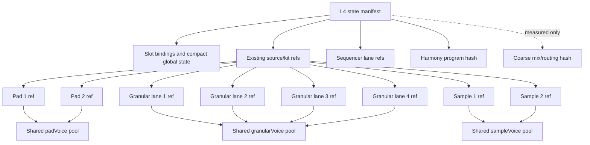

# Preset Reusable Hash-Pool Audit

## Status

Architecture audit only. This document does not authorize or include application, schema, or migration changes.

It provides supporting evidence for [PRESET_SEQUENCER_CONTENT_HASH_PLAN.md](./PRESET_SEQUENCER_CONTENT_HASH_PLAN.md), which is now the single authoritative execution plan for sequencers, reusable sound-content pools, metadata allocation, and graph-first storage.

Owner clarification after this audit selected grouped component refs for harmony and sequencers: chord banks, sequence banks, and harmonic context may hash independently; trigger and each active independently cycling subsequencer may also hash independently. Those D5/D6 decisions in the execution plan supersede this audit's earlier coarse-hash recommendation.

## Objective

Reduce preset storage by hashing reusable musical or sound content once and referencing it from multiple equivalent slots. Preserve independent slot bindings, avoid coupling sound selection to sequencer content, and avoid a graph so fine-grained that database rows, fetches, hashing, and reconstruction cost more than the JSON they replace.

The target is not the maximum possible number of hashes. The target is the minimum total cost:

```
stored payload bytes
+ ref and row overhead
+ save-time canonicalization and hashing
+ load-time graph fetch and reconstruction
+ cache and garbage-collection complexity
```

## Main Conclusion

The current hierarchy has several strong cross-slot reuse opportunities beyond sequencers:

1. The four modern granular lanes are exact schema matches and should use one canonical `granularVoice` content pool.
2. Pad 1 and Pad 2 already have a runtime adapter proving a common schema. They should use one `padVoice` pool, and L4/L3 states should stop persisting fully derived morphed pad values when endpoint hashes plus morph can reconstruct them.
3. Sample 1 and Sample 2 expose the same 23-field schema and should use one `sampleVoice` pool, with level and routing kept in the destination slot binding.
4. Dynamics EQ 1 and EQ 2 are exact schema matches and should use one `dynamicsEq` pool.
5. Insects 1 and Insects 2 are exact schema matches and can use one `insectsVoice` pool, although their small payload makes this a lower priority.
6. Harmony banks and sequences are structured musical content and are a better new child candidate than most scalar L4 metadata.
7. Existing flat-state optimization already removes reconstructable Pad, Drum, Granular, and Water values, but V2 rehydrates them before graph decomposition. Preserving the compact representation through storage can remove many unnecessary child payloads.
8. Several metadata fields should move to the child that owns the corresponding content. Some should remain compact L4 metadata, and some should be removed from metadata because they duplicate relational refs.

Drum voices, delay heads, and per-route scalar groups should not be split into tiny reusable children without database evidence. Their structural or semantic mismatch and row overhead make them poor initial candidates.

## Existing Architecture Findings

### Child identity currently prevents cross-slot reuse

`getPresetChildSpecs()` creates separate scope-specific children for Pad 1/2, Lead 1/2, Granular Voice 1-4, Dynamics EQ 1/2, and Insects 1/2. See `src/presets/presetStorageV2.ts` around lines 592-735.

The V2 dedup lookup is constrained by `(type, scope, resolvedHash)`. See `findMatchingPresetV2()` in `src/presets/SupabasePresetStore.ts` around lines 1210-1250. Even equivalent slot data therefore cannot share a child when:

- the child scopes differ; or
- the JSON keys contain slot prefixes such as `granularV1` and `granularV2`.

Cross-slot reuse requires both:

1. a canonical slot-independent payload schema; and
2. a canonical pool type/scope shared by every compatible destination slot.

Changing only the lookup scope is unsafe because differently prefixed JSON still has different semantics. Changing only the key names is insufficient because the current lookup still partitions by scope.

### Catalog pools and content pools are different concepts

`src/presets/presetPool.ts` already maps Pad 1/2 to the catalog key `pad`, and Lead 1/2 to `lead4opfm`. That controls which named presets are available in the UI.

A content hash pool instead stores an immutable normalized payload once. Multiple manifests may reference the same hash even if their UI catalog filters differ. These concepts should not share naming, tables, or ownership rules.

Suggested terminology:

- **catalog pool**: user-selected list of named preset IDs shown by the UI;
- **content pool**: immutable payloads addressed by canonical content hash;
- **slot binding**: destination-specific source selection, enable, gain, routing, voice mask, or role;
- **content ref**: a slot in a manifest pointing to a reusable payload hash.

## Candidate Ranking

| Priority | Candidate | Schema evidence | Expected benefit | Recommendation |
| --- | --- | --- | --- | --- |
| P0 | Sequencer lanes | Identical within Synth and within Drum; covered by companion plan | Very high | One hash per lane, shared pattern pool, source binding outside |
| P0 | Granular Voice 1-4 | 37 of 37 fields match after prefix normalization | Very high | One `granularVoice` pool; retain four destination refs |
| P0 | Pad 1/2 content | Runtime already has a canonical Pad 1 schema and Pad 1-to-2 adapter | Very high | One `padVoice` pool; avoid storing reconstructable morphed values |
| P0 | Derived state output | Existing optimizer can reconstruct Pad, Drum, Granular, and Water fields | Very high | Keep endpoint hashes/morph/sparse overrides compact through V2 decomposition |
| P0 | Sample 1/2 | 23 of 23 fields match after prefix normalization | High | One `sampleVoice` pool; separate content from mix/routing binding |
| P1 | Dynamics EQ 1/2 | 15 of 15 fields match | High confidence, moderate size | One `dynamicsEq` pool; retain two destination refs |
| P1 | Harmony program/bank | Rich repeated structured musical data | Potentially high | Add one coarse harmony child after corpus measurement |
| P1 | Metadata behavior maps | Keyed to parameters already owned by children | High hash-stability gain | Partition with owning content nodes, not per field |
| P1 | Duplicate `refs` metadata | Refs already have relational V2 rows | Certain storage duplication | Remove from V2 metadata after compatibility migration |
| P2 | Insects 1/2 | 8 of 8 fields match | Low-to-moderate | One `insectsVoice` pool if measurements justify it |
| P2 | Lead 1/2 slot settings | 11 common fields; Lead 1 has 3 extras | Low-to-moderate | Common core plus optional extension only if corpus reuse is high |
| P2 | Coarse mix/routing matrix | Repeated structure, but values are state-specific | Uncertain | Measure one coarse child; never one hash per route/source |
| P3 | Reverb spectral-freeze block | Small submodule inside a large unique source | Low/uncertain | Split only if actual presets reuse it independently |

## Detailed Recommendations

### 1. Granular Voice 1-4: canonical shared pool

The four `granularVoice1` through `granularVoice4` scopes each contain 37 L1 fields with an exact suffix match after removing `granularV1` through `granularV4`. This is the clearest non-sequencer reuse candidate.

Target representation:

```ts
type GranularVoiceContentV1 = {
  schema: 'granularVoice/v1';
  // 37 canonical fields without a lane prefix
};

type GranularKitManifest = {
  voice1: ContentHash;
  voice2: ContentHash;
  voice3: ContentHash;
  voice4: ContentHash;
  // existing legacy granular refs remain distinct
};
```

`granularV1Enabled`/`Gain` through `granularV4Enabled`/`Gain` are already owned by `granularKit`, not the L1 voice payload. Preserve that separation. It makes the content portable while each lane retains independent activation and mix state.

Use destination adapters to translate canonical keys to lane-prefixed runtime keys. Four lanes may independently reference the same hash. Do not replace them with one hash for the entire four-lane kit.

### 2. Pad 1/2: shared content plus derived-state elimination

`src/audio/padPresets.ts` defines `PAD_PRESET_PARAM_KEYS` as a canonical Pad 1 content schema and `PAD1_TO_PAD2_KEY` as its Pad 2 adapter. The runtime therefore already treats Pad 1 and Pad 2 timbre as the same kind of content.

The same file defines `DERIVED_PAD_KEYS` and documents that these values are recomputed on load and are not meaningful in diffs. This reveals a larger optimization than merely sharing Pad 1 and Pad 2 child rows.

Recommended ownership:

- `padVoice` content hash: immutable timbre content in canonical Pad 1 key names;
- pad kit manifest: endpoint A hash, endpoint B hash, morph position, and sparse explicit overrides if manual editing can diverge from the endpoints;
- slot binding: enabled state, level, routing sends, voice mask, octave, and other performance controls;
- derived runtime state: interpolated oscillator/filter/envelope values, reconstructed during load.

Do not persist both endpoint references and every derived morphed parameter in L3/L4 snapshots. That duplicates content and creates a new high-cardinality hash for almost every morph position.

One compatibility question must be answered before implementation: whether users can edit a derived pad parameter independently after selecting endpoints. If yes, preserve only those edits as a sparse override map. If no, endpoint hashes plus morph are authoritative.

The unmapped Pad 1-only `detune` field should be handled as a versioned optional extension or omitted from shared content when the destination does not support it. It is not a reason to retain two entire pools.

The app already performs part of this optimization. `extractOptimizedStatePresetData()` in `src/presets/statePresetOptimization.ts` removes derived values that equal the selected endpoints and morph result. However, `normalizeResolvedVersionData()` in `src/presets/presetStorageV2.ts` hydrates the optimized state before V2 child extraction. The child graph can therefore store the derived values again. The target is to preserve the compact endpoint representation through graph decomposition and hydrate only at the runtime boundary.

### 3. Derived Pad, Drum, Granular, and Water output: keep compact through V2

`src/presets/statePresetOptimization.ts` can regenerate four categories of state:

- Pad 1/2 timbre from preset A, preset B, and morph;
- each Drum voice from voice-specific preset A, preset B, and morph;
- Granular state from the selected granular preset, subject to Delay B linking;
- Water state from Water morph endpoints and morph position.

This is evidence that the fully expanded runtime values are caches, not always authoritative preset content.

Recommended representation for higher-level state and kit manifests:

```ts
type DerivedSelectionV1 = {
  endpointA?: ContentHash;
  endpointB?: ContentHash;
  morph?: number;
  selected?: ContentHash;
  overrides?: Record<string, unknown>;
};
```

Use immutable endpoint content hashes rather than mutable names. Persist only values that differ from deterministic reconstruction as sparse overrides. Hydrate the full runtime object after the graph has loaded.

This does not imply one common Drum pool. Each Drum engine retains its own schema and content type. It only prevents a state preset from duplicating the resolved output of endpoint presets that it already references.

Fallback rules are required:

- if an endpoint cannot be resolved, preserve a full canonical override payload;
- if factory preset algorithms can change, endpoint hashes must resolve the historical content version;
- if manual edits are allowed, only explicit differences become authoritative overrides;
- if reconstruction depends on external non-versioned defaults, the payload is not safely derivable and must remain expanded.

### 4. Sample 1/2: shared source-independent sample voice content

Sample 1 and Sample 2 have the same 23 suffix fields:

`Level`, `DelayASend`, `DelayBSend`, `Enabled`, `LibraryKey`, `Role`, `Articulation`, `SelectionMode`, `DynamicMode`, `FixedDynamic`, `VariantMode`, `AttackMs`, `DecayMs`, `Sustain`, `HoldMs`, `ReleaseMs`, `LoopEnabled`, `MaxVoices`, `Distance`, `PostLPF`, `StereoWidth`, `DiffuseSend`, and `ReverbSend`.

Do not put all 23 into portable content merely because they share a shape. Split by semantic ownership:

- reusable `sampleVoice` content: library key, role, articulation, selection and variant policies, dynamics policy, envelope, looping, maximum voices, distance, post-filter, and stereo width;
- slot binding/mix: enabled, level, Delay A/B sends, diffuse send, and usually reverb send.

This lets the same sampled instrument definition be used in either slot or sequencer without importing the previous slot's gain and effect routing.

If a send is intentionally part of the artistic source preset rather than the state mix, document that exception explicitly. A field's current L3/L4 level is evidence of existing behavior, not proof of correct long-term ownership.

### 5. Dynamics EQ 1/2: exact reusable processor content

EQ 1 and EQ 2 each expose the same 15 fields after prefix normalization. Keep two destination slots in the Dynamics Bus manifest, but point them into one canonical `dynamicsEq` content pool.

Bus-level enable/bypass belongs in the parent binding. EQ coefficients and gains belong in reusable EQ content. This conversion can preserve the current number of child refs, so it provides reuse without increasing graph fanout.

### 6. Harmony: one coarse reusable musical-content child

L4 currently contains structured chord slots, A/B chord-slot banks, chord sequences, and A/B sequence banks. `HarmonyChordSlot` and `HarmonySequenceStep` are rich nested objects, not isolated scalar controls.

Recommended first boundary:

```ts
type HarmonyProgramV1 = {
  schema: 'harmonyProgram/v1';
  chordSlots: HarmonyChordSlot[];
  chordSlotsA?: HarmonyChordSlot[];
  chordSlotsB?: HarmonyChordSlot[];
  sequence: HarmonySequenceStep[];
  sequenceA?: HarmonySequenceStep[];
  sequenceB?: HarmonySequenceStep[];
};
```

Exclude live position such as `harmonyChordSequenceStepIndex`, transport state, current generated output, and source binding. Root, tension, voicing, and other global controls should remain outside unless product semantics define them as part of a saved harmony program.

Begin with one coarse hash. Split A/B banks only if the database corpus shows that users independently reuse a bank across many programs. Per-chord or per-step hashes would produce excessive rows and load work.

### 7. Insects 1/2: exact but small

Both insect lanes contain the same eight fields after prefix normalization. A shared `insectsVoice` pool is semantically sound.

This is lower priority because eight scalar values may be smaller than an additional hidden preset/version/ref graph. It becomes attractive if:

- both refs already exist, so only scope normalization changes;
- the same content appears frequently in the real corpus; or
- direct payload refs replace hidden derived preset wrappers.

### 8. Lead 1/2: do not duplicate the existing timbre pool

The actual FM timbres already use the shared `engine:lead4opfm` library, and UI catalog pooling already maps Lead 1/2 to it. The L1 `lead1` and `lead2` scopes are mostly destination envelope/spatial settings, not separate copies of the main lead preset.

Eleven fields have common semantics after prefix normalization. Lead 1 has three additional fields: density, octave, and octave range.

Recommendation:

- keep the main timbre in the existing shared `lead4opfm` content pool;
- consider a small canonical `leadVoiceSettings` core plus a Lead 1 extension only if measured reuse is substantial;
- do not create a second generic lead timbre pool or merge the two entire slot manifests.

### 9. Mix and routing: one coarse candidate only

L4 repeats level, reverb, delay, granular, degrade, and dynamics routing controls across sources. These have similar structure, but state presets commonly vary them together.

A possible future child is one canonical `mixRouting/v1` matrix containing all source-to-bus routes and gains. It should be evaluated against actual payload size and hash reuse.

Do not create:

- one child per source;
- one child per effect send;
- one child per scalar route; or
- one hash for every source/target pair.

Those designs maximize theoretical component reuse but inflate refs, indexes, fetches, authorization checks, and reconstruction work.

## Metadata Allocation Audit

`PresetVersionMetadata` is currently hashed as one payload even though its fields have different ownership and reuse behavior. `src/App.tsx` around lines 717-750 assembles L4 metadata, and `src/presets/versionMetadataHelpers.ts` copies it between versions.

### Recommended allocation

| Metadata | Current role | Target ownership | Decision |
| --- | --- | --- | --- |
| Routing mute-group scenes | Reusable routing scenes | Existing content-addressed scene refs | Keep current child design |
| Routing mute random settings | L4 behavior | Compact L4 metadata | Keep inline |
| Synth/Drum sequencer fields | Per-lane pattern and arrangement state | Per-lane pattern refs plus L4 slot/arrangement manifest | Move according to sequencer plan |
| `dualRanges` + `sliderModes` | Parameter behavior | Same coarse node that owns each parameter | Partition by owner; never hash per key |
| `refs` | Named preset references | `preset_version_refs_v2` rows | Remove duplicate V2 metadata copy |
| `presetPool` | UI catalog membership/filter | User preference, or one reusable config child if state-specific | Clarify product semantics, then relocate |
| `journeyPreview` | Small list-view summary | Denormalized preset summary metadata | Keep inline |

### Complete sequencer metadata disposition

The formal metadata interface in `src/presets/types.ts` contains the following ungrouped sequencer arrays and maps. They should be partitioned per lane during the sequencer migration rather than moved into one new all-sequencer child.

| Current fields | Recommended owner | Reason |
| --- | --- | --- |
| `drumEvolveConfigs`, `synthEvolveConfigs` | Corresponding lane pattern | Defines how that saved lane evolves |
| `drumStepOverrides`, `synthStepOverrides` | Corresponding lane pattern | Direct step-level musical content |
| `drumClockDivs`, `synthClockDivs` | Corresponding lane pattern | Lane timing behavior; source-independent |
| `drumSwings`, `synthSwings` | Corresponding lane pattern | Lane timing feel; source-independent |
| `drumLinked`, `synthLinked` | Corresponding lane pattern | The companion plan treats intrinsic linked/polyrhythmic behavior as pattern timing |
| `drumSubLaneStates`, `synthSubLaneStates` | Corresponding lane pattern | Capability-specific lane content |
| `synthArpConfigs` | Corresponding Synth lane pattern | Capability-specific pattern behavior |
| `drumPitchSettings`, `synthPitchSettings` | Corresponding lane pattern | Persist an explicit portable pitch representation, not a selected source identity |
| `synthPitchBindingModes` | Corresponding Synth lane pattern capability | The mode can travel with the pattern while the selected source remains in L4 binding |

### Ungrouped structured state outside formal metadata

Some optimization candidates are registered parameters rather than `PresetVersionMetadata`, but have the same current problem: they remain embedded in a larger resolved payload instead of having an explicit reusable owner.

| Current state | Current location | Recommendation |
| --- | --- | --- |
| `synthSequencerFaces` | `synthEuclidean` L1 payload | L4 sequencer arrangement; it selects a lane capability/face rather than pattern content |
| `synthSequencerChain` | `synthEuclidean` L1 payload | Coarse Synth arrangement child or compact L4 manifest |
| `drumSequencerChain` | `drumEuclidean` L1 payload | Coarse Drum arrangement child or compact L4 manifest |
| Harmony slot and sequence arrays | Global L4 payload | One coarse `harmonyProgram` child |
| Sample 1/2 definitions | Mostly Synth L3 payload, with level/sends at L4 | Shared `sampleVoice` content refs plus L4 slot/mix binding |
| Repeated source routing controls | Global L4 payload | One measured `mixRouting` child at most; otherwise keep inline |

Chain entries and sequencer face settings should not be included in an individual pattern hash. They describe how independently reusable patterns are placed and coordinated in the state.

### Sequencer metadata

The evolve configuration, step overrides, clock divisions, swing, linked state, sub-lane state, arpeggiator configuration, pitch settings, and pitch binding modes are currently ungrouped metadata fields.

They should not remain one global sequencer metadata blob. Assign each field using the ownership rules in the companion sequencer plan:

- pattern-defining behavior belongs in that lane's canonical pattern payload;
- source selection and slot role remain in the L4 binding;
- cross-lane chain/order belongs in a coarse arrangement child or compact L4 manifest;
- transient playback position is not preset content.

This preserves one independent hash for every sequencer while allowing all compatible lanes to draw from the same content pool.

### Dual ranges and slider modes

These two maps are logically one parameter-behavior structure. A range without its mode is incomplete. Today, changing behavior for one granular field can churn the hash of the entire metadata payload.

Recommended representation:

```ts
type ParameterBehavior = {
  mode: 'single' | 'walk' | 'sampleHold';
  range?: { min: number; max: number };
};
```

Partition behavior entries by the same ownership registry used for values:

- behavior for canonical granular voice keys travels with `granularVoice` content;
- behavior for Pad 1/2 canonical timbre keys travels with `padVoice` content;
- behavior for EQ keys travels with `dynamicsEq` content;
- behavior for L4-only controls remains in one compact L4 behavior map.

Do not add a content row per parameter. Either embed behavior beside values in the coarse child payload or add one behavior map per existing child.

### Relational refs duplicated in metadata

`extractPresetVersionMetadata()` copies `version.refs` into `metadata.refs` in `src/presets/presetUtils.ts` around lines 318-334. V2 also persists graph refs in `preset_version_refs_v2`.

For V2, the relational rows should be authoritative and refs should be reconstructed on read for legacy in-memory APIs. Keeping refs in both places wastes metadata payload space and permits disagreement between two sources of truth.

Legacy file/bundled formats may continue embedding refs until their format version changes.

### Preset catalog pool

`presetPool` is saved with every L4 state and loaded into app-level active catalog state. Decide whether catalog membership is:

1. a user/library preference independent of a musical state; or
2. intentional state behavior controlling future randomization/evolution.

If it is a preference, move it to user/device settings and stop storing it in every state. If it is state behavior, keep one coarse `presetPoolConfig` content hash. Do not split it by engine unless the arrays are large and independently reused.

### Journey preview

The journey preview is a small derived list-view summary. A separate content ref would cost more than its payload and would add a fetch to render summaries. Keep it denormalized and inline.

### Correctness finding: Drum pitch metadata is truncated

`src/App.tsx:736` normalizes `drumPitchSettingsRef.current` with a hard-coded lane count of `4`, while the current Drum sequencer has six lanes. Synth correctly uses four at line 737.

This can omit Drum lane 5/6 pitch settings during L4 save. The future architecture should use the authoritative lane-count constant, and the migration/audit should detect affected presets. This is a correctness issue independent of storage optimization.

## Candidates To Avoid Initially

### Unified Drum voice pool

The seven Drum engines have materially different fields and DSP semantics. Beep High and Beep Low share only five normalized fields, not an equivalent voice schema. Keep separate engine content types.

The repeated L2 morph controls (`PresetA`, `PresetB`, morph, auto, speed, mode) are only a few scalars per voice. Separate hashes for those strips would likely cost more than storing them in the Drum kit manifest.

### Clocked Space tape-head children

Four tape heads repeat only enabled, level, and pan. Normalize them into a compact array if canonical JSON size matters, but do not create four separately fetched child rows.

### Delay engines

Lead Delay, Echo Line, and Clocked Space have different behavior. A shared `delayVoice` pool would be false abstraction. Their common sends and levels belong in routing, not shared delay content.

### Granular legacy engines

`granularLegacy` and `legacyGranular` do not match the four modern 37-field voices. Keep them separate and do not force compatibility through defaults.

### Fine-grained Dynamics and Degrade children

End Chain, saturation, drift, and erosion are already reasonably coarse children. Splitting their small submodules creates fanout with little cross-preset reuse. Erosion is large but unique; large size alone does not justify more child hashes.

### Per-field metadata hashes

Never create a content row for one scalar value, one slider mode, one range, one mute flag, one route, one chord step, or one tape head. Hashing granularity should follow independently reusable product concepts, not every repeated object shape.

## Target Graph Shape



The destination ref slots remain distinct. The target content pool is shared. This permits Pad 1 and Pad 2, or Granular 1-4, to reference the same hash without making their enable, gain, routing, source selection, or UI identity the same.

## Canonical Hash Rules

Every reusable payload should:

1. Include an explicit schema discriminator such as `granularVoice/v1`.
2. Use slot-independent field names.
3. Omit transient, generated, and destination-binding state.
4. Normalize defaults, numeric edge cases, missing values, enum aliases, and object-key order before hashing.
5. Preserve ordered arrays where order is musical meaning.
6. Reject unknown fields at the canonical boundary or place versioned extensions in a defined namespace.
7. Use the same canonical serializer and hash implementation on all save paths.

The content hash must describe the canonical payload, not the source slot, UI preset name, owner, visibility, or database row identity.

## Storage and CPU Constraints

### Prefer reuse without increasing ref count

The best first conversions normalize pools for children that already exist:

- four Granular voice refs remain four refs;
- two EQ refs remain two refs;
- two Pad refs remain two refs;
- two Insect refs remain two refs.

These changes reduce duplicate payloads without adding graph depth.

New children should be limited to large, independently reusable concepts such as sequencer patterns, sample voice definitions, and harmony programs.

### Prefer direct content refs for internal graph nodes

The current V2 implementation creates hidden derived preset wrappers around child payloads. That adds preset and version rows for data that has no user-facing identity.

Long-term, internal reusable nodes should be direct content refs with:

- `version_id`;
- destination-specific `ref_slot`;
- canonical `content_type` and schema version;
- `content_hash`;
- optional sparse override hash only where product semantics require it.

Named user presets can continue having preset/version identity. Do not create user-visible presets for every internal hash.

If a direct-ref migration is deferred, use one canonical derived scope per content type so cross-slot reuse works within the existing graph.

### Batch all graph I/O

Do not introduce an N+1 query for every child. Save and load should:

- canonicalize each candidate once;
- memoize identical canonical JSON within the transaction;
- hash unique payloads in one worker/batch where possible;
- probe existing hashes in one database call;
- insert missing payloads and refs in batches;
- fetch all referenced payloads in one detail RPC;
- reconstruct destination keys in memory.

Database indexes should support unique payload hash lookup and `(version_id, ref_slot)` graph access. Foreign-key columns need indexes. Authorization should derive access from the parent preset/version owner rather than duplicating ownership into every immutable payload.

### Measure net savings, not payload savings alone

For candidate `C`, calculate:

```
net_savings(C) = duplicate_payload_bytes_removed
               - new_payload_row_overhead
               - new_ref_row_overhead
               - index_overhead
               - expected query/CPU cost converted to budget
```

Required corpus measurements:

- number of manifests referencing the candidate slots;
- unique canonical hashes versus total references;
- median and p95 canonical payload bytes;
- average refs and graph depth per L4 state;
- detail-RPC bytes and query count;
- save canonicalization/hash time;
- cold and warm load reconstruction time;
- garbage-collection reachability time.

No candidate below P1 should be implemented without these measurements.

## Recommended Rollout Order

1. Establish one canonical content-node API, schema versioning rule, corpus metrics, and batched graph I/O.
2. Implement the per-lane sequencer architecture from the companion plan.
3. Convert Granular Voice 1-4 to one pool because the schemas are exact and refs already exist.
4. Convert EQ 1/2 to one pool using the same mechanism.
5. Preserve the existing compact derived-state representation through V2, starting with Pad and then validating Drum, Granular, and Water.
6. Convert Pad 1/2 to one content pool, including an explicit decision on sparse overrides.
7. Extract Sample 1/2 portable content while retaining mix/routing in slot bindings.
8. Partition sequencer metadata and parameter behavior maps by their owning content nodes.
9. Remove duplicate V2 `metadata.refs` and decide whether `presetPool` is user preference or state behavior.
10. Add a coarse harmony-program child if corpus measurements confirm reuse.
11. Evaluate Insects, Lead slot settings, mix/routing, and spectral freeze only from measured net benefit.

## Architectural Gates Before Implementation

The following decisions must be written as product invariants before code changes:

1. Which fields are portable content versus destination binding for Pad, Sample, Lead, and Granular slots?
2. Can users manually override Pad, Drum, Granular, or Water values after endpoint selection, and if so, are those edits sparse authoritative overrides?
3. Is `presetPool` part of a saved musical state or a user/library preference?
4. Which harmony controls define a reusable harmony program, and which are live performance context?
5. Will internal nodes use direct payload refs now, or canonical hidden derived scopes as a transitional format?
6. What minimum payload size, reuse ratio, or net byte saving justifies a separate child?
7. Is the graph authoritative on new writes, with the full `resolved_hash` retained only as a cache/compatibility snapshot?

## Acceptance Criteria For Any Future Change

- Equivalent content in compatible slots produces the same canonical hash.
- Different slot bindings do not change the content hash.
- Loading a sound preset never implicitly loads a sequencer pattern.
- Loading a pattern never changes the selected sound source.
- Four Granular lanes and individual sequencers retain separate refs and can diverge independently.
- Legacy presets load with unchanged audible and musical behavior.
- Batched save/load query counts do not grow linearly with child count.
- Net stored bytes decrease after including payload, ref, version, preset, and index rows.
- Save and cold-load CPU remain within explicit budgets.
- Missing or unauthorized child payloads fail predictably without partially applying unrelated state.

## Final Recommendation

Adopt shared canonical pools where slot equivalence is already proven, while retaining destination-specific refs and bindings. Start with Granular 1-4, Pad 1/2, Sample 1/2, and EQ 1/2. Preserve the app's existing compact derived-state representation through V2 rather than re-expanding it for child hashing. Treat harmony as the strongest new coarse L4 child. Partition metadata according to content ownership, remove duplicated relational refs, and keep small summaries and bindings inline.

Do not pursue universal decomposition. The optimal preset graph contains independently reusable musical concepts, not the smallest possible objects.
