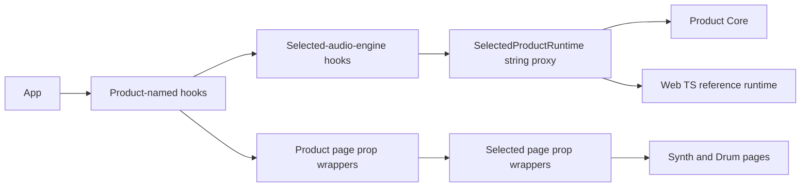
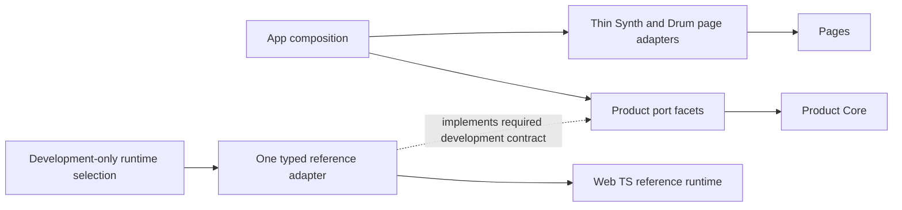
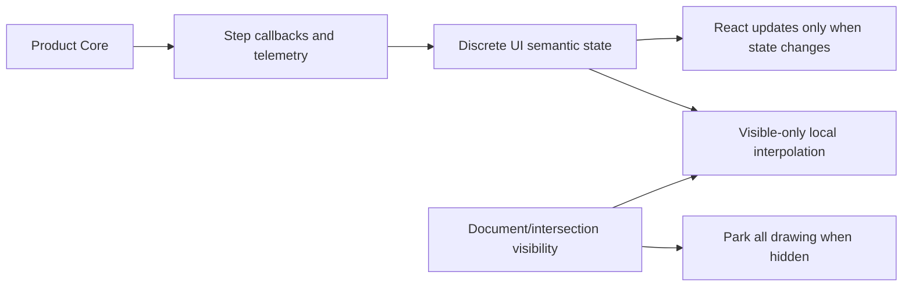

# Tech-debt cleanup implementation plan

Date: 2026-07-20

## Objective

Reduce production and maintenance code, remove migration-era runtime wrappers, make missing Product Core behavior fail visibly, and reduce avoidable UI CPU work without changing Product Core audio timing or sound.

Expected total effort: 30-44 senior engineer-days.

Expected reduction:

- 10,000-14,000 production/test-support source lines.
- 4,000-7,000 script/checker lines.
- 15,000-21,000 total lines, including hidden tools and obsolete checks.

This document is intentionally prescriptive. An implementation pass should follow the named order, examples, tests, and stop conditions. It should not invent replacement abstractions while coding.

## Fixed decisions

These decisions are already made and must not be reopened during implementation:

1. Delete `SnowflakePrototypePage` and `SnowflakeGeneratorPage`, including their CSS, query routes, App branches, compatibility props, and obsolete source-text checks.
2. Keep the production Snowflake generator under `src/snowflake/**`, `src/ui/snowflakeV2/**`, and `src/ui/SnowflakeUI.tsx`.
3. Make the CPU overlay development-only and dynamically loaded.
4. Drop automatic legacy preset support. Normal save/load accepts only the current canonical format and reports incompatible data explicitly.
5. Use the existing Product port facets under `src/audio/product/ports/**` as the application runtime contract. Do not introduce another generic runtime facade.
6. Keep the Web TS runtime active only as a development parity/A-B adapter.
7. Remove wrappers by complete capability slices. Each slice deletes its retired path in the same change.
8. Use fail-fast runtime contracts: throw for programming errors, return typed `not-ready` for runtime readiness, and expose unsupported capabilities explicitly.
9. Unify preset behavior through a shared controller and shared UI primitives with thin Synth and Drum adapters. Do not build a large conditional mega-component.
10. Keep test-only reference implementations under an explicit reference or test-support entry. Do not pretend they are production-reachable.
11. Replace source-text implementation checks with structural import rules, behavior tests, or generated ABI checks.
12. Product telemetry owns musical state. Local `requestAnimationFrame` may interpolate visible drawing only and must never simulate Product sequencing.
13. Make the corrected architecture and lifecycle gates mandatory.

## Protected boundaries

Do not change these behaviors as incidental cleanup:

- Product Core DSP, WASM, AudioWorklet render timing, event sample offsets, or sequencing semantics.
- Synchronous audio-context priming and iOS media-session setup inside the initiating user gesture.
- Resume quantization, lane audibility transitions, background-audio resume handling, or Product Journey scheduling.
- The active Reactive Visualizer implementation.
- Supabase schema, RLS, RPCs, or migrations during packages 1, 2, 4, or 5.
- Generated source under `src/audio/generated/**`.
- Web TS reference algorithms still used by named parity tests.

If a required Product telemetry value does not exist, stop that subtask and add an explicit Product telemetry/port requirement. Do not add a UI clock, no-op callback, guessed value, or reference-runtime fallback.

## Target architecture

### Current runtime flow



### Required runtime flow



Rules for the target:

- Production UI may import Product port types and the Product engine proxy.
- Production Product modules may not import `useSelectedAudioEngine*`, `SelectedProductRuntime`, or Web TS code.
- A page prop may be mapped once at the App/page boundary. It may not be renamed through Product and Selected layers.
- Reference-specific behavior belongs under `src/audio/reference/**` or `src/ui/referenceRuntime/**`.
- Keep a hook only when it owns real React behavior such as state, an effect, subscription cleanup, or a stable callback required by a consumer.

## Universal implementation procedure

Follow this procedure for every numbered subtask:

1. Run `git status --short` and record pre-existing changes. Do not discard unrelated work.
2. Run the subtask's baseline tests before editing. If a baseline test fails, record it and do not attribute it to the cleanup.
3. Use `rg` to list every importer and source-text checker that names a file before deleting or renaming it.
4. Add or strengthen a behavior/structural test before removing a path when the old checker is the only evidence.
5. Make one bounded edit. Do not mix another package into the same edit.
6. Run `npm run type-check` and the subtask tests.
7. Measure net lines with `git diff --numstat` and inspect `git diff --check`.
8. Delete obsolete files and exact-source checks in the same subtask.
9. Do not proceed to the next subtask while a new failure remains.
10. Do not add `Compat`, `Fallback`, `Selected`, `Legacy`, or another `Bridge` file to solve a migration problem.

Every subtask must produce net deletion unless it is a test/CI infrastructure subtask with an explicitly stated future deletion payoff.

## Validation tiers

### Tier A: after every bounded edit

```bash
npm run type-check
git diff --check
```

Run the specific regression named by the subtask as well.

### Tier B: after every capability slice

```bash
npm run build
npm run architecture:product-core-truth
npm run core:product:runtime-selection-isolation
npm run migration:no-web-ts-bundle
```

### Tier C: after every work package

```bash
npm run architecture:strict
npm run core:product:browser-runtime
```

Run CPU comparisons only when the package can affect mounted UI work or runtime scheduling.

### Tier D: final validation

```bash
npm run core:product:ci
```

The complete Product CI is expensive. Do not run it after every small edit.

---

# Work package 1: safe deletion and production isolation

Effort: 4-6 engineer-days.

Expected reduction: 6,700-7,600 lines.

This package may be implemented as one initiative, but its three subtasks must remain independently testable.

## 1.1 Delete the hidden Snowflake pages

### Delete

- `src/ui/SnowflakePrototypePage.tsx`
- `src/ui/snowflakeGenerator/SnowflakeGeneratorPage.tsx`
- `src/ui/snowflakeGenerator/SnowflakeGeneratorPage.css`
- Delete the empty `src/ui/snowflakeGenerator` directory afterward.

### Edit

- `src/App.tsx`
- `src/app/appRouteFlags.ts`
- `src/ui/useSelectedAudioEnginePlaybackUiProps.ts`
- Any Product wrapper that forwards `snowflakePrototypePlaybackProps`.
- `scripts/check-kessho-product-cpu-scenarios.mjs`
- `scripts/check-product-engine-boundary.mjs`
- `scripts/check-piano-source-cleanup.mjs`
- `scripts/check-kessho-product-default-gate-v3.mjs`

### Steps

1. Verify the retained generator importers:

   ```bash
   rg -n "snowflake/SnowflakeGenerator|snowflakeV2" src/ui/SnowflakeUI.tsx src/ui/snowflakeV2
   ```

2. Remove the two page imports, route booleans, and early-return route branches from `App.tsx`.
3. Remove `isSnowflakePrototypeRoute`, `isSnowflakeGeneratorRoute`, and their clear functions from `appRouteFlags.ts`.
4. Remove `snowflakePrototypePlaybackProps` at its source, not only at the App call site.
5. Delete source-text assertions that require the prototype. Do not replace them with assertions requiring `SnowflakeUI` implementation snippets.
6. Delete the page files and CSS.
7. Confirm no route or page reference remains:

   ```bash
   rg -n "SnowflakePrototypePage|SnowflakeGeneratorPage|snowflakePrototype|snowflakeGenerator" src scripts
   ```

8. Confirm the production generator still has at least these importers:

   - `src/ui/SnowflakeUI.tsx`
   - `src/ui/snowflakeV2/useSnowflakeV2.ts`

### Tests

```bash
npm run type-check
npm run build
npm run migration:product-boundary
npm run core:product:page-cpu-comparison
```

The CPU comparison is a regression check, not an expectation of a large CPU gain.

### Success criteria

- No source or script reference to either hidden page or query flag.
- Production Snowflake renders and responds to source levels and FX sends.
- `src/snowflake/SnowflakeGenerator.ts` remains in use.
- At least 4,146 physical lines deleted before route/guard cleanup.
- No replacement hidden route or compatibility prop added.

## 1.2 Make CPU overlay development-only

The performance adapter also feeds the development runtime comparison panel. Do not delete the entire performance adapter in this subtask.

### Target pattern

Create a small development host that owns the dynamic import. Do not import `CpuOverlay` as a production value from `App.tsx`.

```tsx
// Example shape. Use the repository's existing React import style.
const DevCpuOverlay = import.meta.env.DEV
  ? lazy(() => import('./ui/CpuOverlay').then((module) => ({ default: module.CpuOverlay })))
  : null;

// In render:
{DevCpuOverlay ? (
  <Suspense fallback={null}>
    <DevCpuOverlay
      setPerfMonitorEnabled={setProductPerfMonitorEnabled}
      setPerfUpdateCallback={setProductPerfUpdateCallback}
    />
  </Suspense>
) : null}
```

If the production build still emits a CPU overlay chunk, move the conditional and import into a development-only module selected by a Vite alias. Do not accept a production chunk merely because it is lazy.

Move the overlay keyboard shortcut to `useKeyboardScope`; do not leave another direct `window` listener.

### Tests

```bash
npm run type-check
npm run build
npm run architecture:mobile-debug-policy
```

Inspect `dist/assets` and the Vite manifest. The production build must not contain a `CpuOverlay` chunk or the text `Ctrl+Shift+P` from the overlay.

### Success criteria

- CPU overlay remains usable in local development.
- Production App does not mount it or register its shortcut.
- No production bundle chunk contains the overlay implementation.
- Product CPU collection remains available to explicit development A/B tooling.

## 1.3 Replace zero-import TSX checking with entry reachability

Replace `scripts/check-web-tsx-reachability.mjs`. The new check must traverse imports from declared entries rather than count importers.

### Required entry groups

```js
const entryGroups = {
  production: ['src/main.tsx'],
  workers: [/* actual worker/worklet entries discovered with rg */],
  platform: [/* actual .ios/.native entries used by build configuration */],
  tests: [/* test files are classified, not considered production */],
};
```

Do not invent worker or platform entries. Discover them from Vite configuration, package scripts, `new Worker(...)`, `audioWorklet.addModule(...)`, and platform resolver configuration.

### Traversal example

```js
function visit(file, reachable) {
  if (reachable.has(file)) return;
  reachable.add(file);
  for (const target of localImports(file)) visit(target, reachable);
}

const productionReachable = new Set();
for (const entry of entryGroups.production) visit(resolve(entry), productionReachable);

const disconnectedProductionCandidates = sourceFiles.filter((file) =>
  !productionReachable.has(file) &&
  !isTest(file) &&
  !isDeclaredAlternateEntry(file)
);
```

The resolver must support `.ts`, `.tsx`, `.js`, `.jsx`, and `index.*`. Use TypeScript preprocessing or the TypeScript AST. Do not use regular expressions to parse imports.

### Deletion policy

- No production importer, test importer, or alternate entry: delete.
- Test-only importer: move under an explicit `reference` or `testSupport` directory when the test is still valuable.
- Source-text checker only: delete unless a real build/runtime entry exists.
- Platform-looking suffix but no resolver/build entry: treat as dead after verifying build configuration.

### Tests

Add fixture-based tests proving:

- An internally connected but entry-disconnected two-file tree fails.
- A reachable `.ts` module passes.
- A declared worker entry passes.
- A test-only helper is classified as test support, not production.
- A stale alternate-entry allowlist item fails.

Then run:

```bash
npm run architecture:web-tsx-reachability
npm run type-check
npm run build
```

Rename the package script only if necessary; keeping the existing script name avoids unnecessary churn.

### Success criteria

- The checker covers TS and TSX entry reachability.
- No disconnected production tree survives merely because its files import one another.
- Approximately 2,500-2,900 confirmed dead lines deleted.
- Test/reference support remains runnable through explicit entries.
- The checker is deterministic and requires no network or built bundle.

---

# Work package 2: Product runtime boundary burn-down

Effort: 10-15 engineer-days.

Expected reduction: 2,600-4,300 lines.

Do not implement this as one repository-wide rewrite. Complete the slices below in order.

## Wrapper classification rule

Classify each touched wrapper before editing:

| Wrapper kind | Recognition | Required action |
|---|---|---|
| Identity | Returns the same input object/fields, often in `useMemo` | Inline and delete |
| Rename | Maps Product names to Selected names or back | Move real behavior to Product naming, update caller, delete rename layer |
| Mode switch | Branches on `core-product` versus reference | Product path calls Product port directly; move reference branch to one development adapter |
| Composition | Combines multiple real hooks | Keep only if it removes complexity from callers and owns no compatibility naming |
| Fallback | Supplies no-op, fake telemetry, guessed value, or alternate engine | Implement explicit contract, then delete fallback |

Never respond to a difficult wrapper by adding another wrapper.

## 2.0 Establish contract tests and inventory

Before changing wrappers:

1. Generate a table of every `useProductRuntime*` and `useSelectedAudioEngine*` file with line count and direct importers.
2. Mark each file with one classification from the table above in a temporary audit note.
3. Identify the Product port facet used by each capability:

   - lifecycle
   - command
   - control
   - telemetry
   - sequencer
   - diagnostics
   - assets
   - journey
   - modulation

4. Add a structural rule that production `useProductRuntime*` files cannot import:

   - `useSelectedAudioEngine*`
   - `SelectedProductRuntime`
   - `src/audio/reference/**`

The rule may initially report existing violations as a generated inventory. Tighten the allowed count after every slice; it must reach zero by the end of package 2.

### Success criteria

- Every wrapper has a known classification and owner slice.
- No uncategorized wrapper is changed.
- Baseline lifecycle, live-note, browser-runtime, and reference parity tests are recorded.

## 2.1 Delete page identity and bridge wrappers

Start with:

- `useProductRuntimePageSurface.ts`
- `useProductRuntimePageBridgeOptions.ts`
- `useProductRuntimePageControlProps.ts`
- `useProductRuntimePageSequencerProps.ts`
- `useProductRuntimePageTelemetryProps.ts`
- `useProductRuntimePageRuntimeBridges.ts`
- Matching `useSelectedAudioEnginePage*` modules.

### Target

App should create one typed object for each page boundary and pass it directly to the existing Synth/Drum page bridge or page component.

```tsx
// Target shape: one mapping, no identity hooks.
const synthRuntimeProps: SynthRuntimeProps = useMemo(() => ({
  onLiveNoteStart: productEvents.onLiveNoteStart,
  onLiveNoteStop: productEvents.onLiveNoteStop,
  setStepPositionCallback: productEngine.setSynthStepPositionCallback,
  getGranularVisualEvents: productEngine.getGranularVisualEvents,
  // Only fields actually consumed by SynthPage.
}), [productEvents]);
```

Do not copy the current combined 40-field option type into a new file. Define page-specific types from actual component props or existing focused port facets.

### Procedure

1. Start with one page, preferably Drum if it has fewer fields.
2. Map each prop once.
3. Run type checking and page tests.
4. Delete the retired Product and Selected page wrappers for that page.
5. Repeat for Synth.
6. Remove stale static checks that require the wrapper names.

### Tests

```bash
npm run type-check
npm run test:synth-play-controls-ui
npm run test:drum-sequencer-transport-policy
npm run core:product:sequencer-ui
npm run core:product:browser-runtime
```

### Success criteria

- Page values cross at most one mapping boundary.
- No identity `useMemo` page-prop hook remains.
- No Product page module imports a Selected page module.
- Mounted Synth, Drums, Global, and Snowflake navigation work.
- Net deletion is at least 500 lines for this slice.

## 2.2 Consolidate callback registration and telemetry

Start with:

- `useProductRuntimeCallbackSurfaces.ts`
- `useSelectedAudioEngineCallbackSurfaces.ts`
- `useRuntimeSequencerProjectionCallbacks.ts`
- `useProductRuntimeLiveTriggerSurface.ts`
- `useSelectedAudioEngineLiveTriggerSurface.ts`
- `useProductRuntimeTelemetry.ts`
- `useSelectedAudioEngineTelemetrySurface.ts`

### Callback contract

All callback setters must accept `callback | null`.

```ts
type CallbackRegistration<T> = (callback: T | null) => void;

const setLeadMorphCallback: CallbackRegistration<(morph: LeadMorph) => void> =
  productEngine.setLeadMorphCallback.bind(productEngine);
```

Forbidden replacement:

```ts
selectedRuntime.setLeadMorphCallback(callback ?? (() => {}));
```

Required behavior:

- `null` unregisters.
- Unsupported registration returns an explicit unsupported capability or throws at development adapter construction.
- A missing callback method is not discovered through a string proxy during use.

### Telemetry contract

Do not return `0`, an empty array, or a fabricated state when required Product telemetry is unavailable.

```ts
function requireSampleRate(telemetry: CoreProductTelemetrySnapshot | null): number {
  const sampleRate = telemetry?.sampleRate;
  if (!sampleRate || !Number.isFinite(sampleRate)) {
    throw new ProductRuntimeNotReadyError('sample-rate-unavailable');
  }
  return sampleRate;
}
```

Use a typed `not-ready` result instead of throwing when the caller represents an expected user command that may occur before initialization.

### Tests

Add tests proving:

- Register, replace, unregister, and unmount call the Product setter correctly.
- `null` does not install a no-op function.
- Missing required telemetry produces an explicit failure.
- Reference development adapter declares unsupported visual telemetry rather than returning four `null` entries.

Run:

```bash
npm run architecture:projection-unification
npm run core:product:runtime-selection-isolation
npm run core:product:live-note-contract
npm run core:product:sequencer-ui
```

### Success criteria

- No `callback ?? (() => {})` remains in runtime registration code.
- Product callbacks use Product port methods directly.
- No fabricated projection arrays remain.
- Reference unsupported state is visible and development-only.
- No callback/effect registration count increases.

## 2.3 Make live-note input strictly owned

### Edit

- `src/ui/keyboard/liveNoteInput.ts`
- `src/ui/synth/SynthPage.tsx`
- App MIDI live-note composition.
- Product live-note event adapter and tests as required.

### Target props

```ts
type SynthLiveNoteProps = {
  onLiveNoteStart: (event: ProductLiveNoteEvent) => Promise<void>;
  onLiveNoteStop: (event: ProductLiveNoteEvent) => void;
};
```

Remove the Synth fallback that converts a held note into a 180 ms audition.

The controller must preserve cleanup after a rejected start, but it must expose the failure:

```ts
type LiveNoteStartResult =
  | { status: 'started'; event: ProductLiveNoteEvent }
  | { status: 'failed'; event: ProductLiveNoteEvent; error: Error };
```

Do not swallow the error and report `true`. The exact error transport may be a rejected promise or typed result, but every caller and test must observe it.

### Tests

```bash
npm run test:live-note-input
npm run core:product:live-note-contract
npm run test:synth-play-controls-ui
```

Add or retain cases for keyup, pointer cancel, repeated keydown, visibility loss, runtime replacement, start rejection, and stop cleanup.

### Success criteria

- Every held synth note has one start and one matching stop.
- No one-shot audition fallback exists in held-note code.
- Start failure is observable.
- Cleanup never leaves an active-note entry behind.
- Drum MIDI one-shot semantics remain unchanged.

## 2.4 Collapse playback, lifecycle, media, and platform wrappers

Start with:

- `useProductRuntimePlaybackControls.ts`
- `useSelectedAudioEnginePlaybackControls.ts`
- `useProductRuntimeLifecycle.ts`
- `useSelectedAudioEngineLifecycle.ts`
- Product/Selected start, stop, media-session, Capacitor, Mac recovery, and playback-start-state pairs.

### Target lifecycle hook

Keep one Product-named hook only if React stability is needed:

```ts
export function useProductPlaybackLifecycle(): ProductPlaybackLifecycle {
  const start = useCallback(async (options: StartProductPlaybackOptions) => {
    // Must remain in the user-gesture call stack.
    setupProductIOSMediaSession();
    await productEngine.start({ initialState: options.state });
    connectProductMediaSessionToAudio();
  }, []);

  const stop = useCallback(() => {
    stopProductIOSMediaSession();
    void productEngine.stop();
  }, []);

  return useMemo(() => ({ start, stop }), [start, stop]);
}
```

The real implementation may require existing Capacitor diagnostics. Preserve their ordering exactly. Rename variables to Product terminology rather than mapping through Selected terminology.

### Reference mode

Move reference lifecycle construction behind a single development-only adapter. Production hooks must not branch on reference mode.

### Tests

```bash
npm run test:product-runtime-lifecycle
npm run test:product-runtime-policy
npm run core:product:background-audio
npm run core:product:browser-runtime
npm run migration:no-web-ts-bundle
```

### Success criteria

- Product lifecycle does not import Selected lifecycle.
- iOS media setup remains synchronous before the first awaited operation.
- Stop order remains media session then Product engine unless an existing behavioral test proves a different required order.
- Background resume behavior is unchanged.
- Reference lifecycle is development-only.
- Net deletion is at least 600 lines for this slice.

## 2.5 Retire the Selected runtime proxy and remaining wrappers

### Delete or quarantine

- `src/audio/product/SelectedProductRuntime.ts` from production paths.
- Remaining wrapper-only `useSelectedAudioEngine*` modules.
- Remaining `TODO(product-fallback-retire:...)` markers whose path is now removed.

The reference adapter must be explicit and typed. It may not be `Record<string, unknown>` plus a `Proxy`.

```ts
type ReferenceRuntimeAdapter = Pick<
  ProductEnginePort,
  'start' | 'stop' | 'resume' | 'suspend' | 'enqueueLiveNoteEvent'
>;

export async function loadReferenceRuntimeAdapter(): Promise<ReferenceRuntimeAdapter> {
  const runtime = await loadReferenceAudioRuntime();
  return {
    start: (options) => runtime.audioEngine.start(options.initialState),
    stop: () => runtime.audioEngine.stop(),
    resume: () => runtime.audioEngine.resume(),
    suspend: () => runtime.audioEngine.suspend(),
    enqueueLiveNoteEvent: (event) => runtime.audioEngine.enqueueLiveNoteEvent(event),
  };
}
```

Only include capabilities actually used by development parity. Unsupported Product-only telemetry is declared unavailable; it is not faked.

### Final package searches

```bash
rg -n "TODO\(product-fallback-retire:" src/audio src/ui
rg -n "useSelectedAudioEngine|SelectedProductRuntime" src/App.tsx src/ui src/audio/product
rg -n "callback \?\? \(\(\) => \{\}\)" src/ui src/audio/product
```

Expected results:

- No fallback TODOs in production.
- No Selected runtime import in Product production paths.
- Any surviving Selected/reference name is located only under an explicit development/reference boundary and documented.

### Final package tests

```bash
npm run type-check
npm run build
npm run architecture:strict
npm run core:product:no-temporary-runtime-compat
npm run core:product:runtime-selection-isolation
npm run core:product:browser-runtime
npm run core:product:sequencer-ui
npm run core:product:background-audio
```

### Package success criteria

- At least 2,600 net source lines deleted.
- Product UI has no dependency on Selected hooks or string-dispatched runtime methods.
- Production build contains no Web TS reference bundle.
- All unsupported paths fail explicitly.
- Browser playback, live note, sequencer, background audio, and development parity tests pass.

---

# Work package 3: preset cleanup

Effort: 8-13 engineer-days.

The active Supabase/preset work was reported complete on 2026-07-20, so this package is ready to implement after recording a fresh preset and database-audit baseline.

Before implementation, read the repository Supabase skill, check the current Supabase changelog and documentation, inspect the final preset schema produced by the completed work, and run all preset baselines. Do not make a database migration as part of a UI cleanup change.

## 3.1 Drop automatic legacy preset support

Effort: 4-7 days.

### Required behavior

- Normal load accepts exactly the current canonical schema.
- Unsupported version returns or throws `UnsupportedPresetVersionError`.
- Normal save writes exactly the current canonical schema.
- No normal path attempts an older decoder after current decoding fails.
- No normal path repairs legacy aliases or missing fields.
- If an explicit one-time maintenance operation is still needed for stored data, it must run before legacy code is deleted and must not remain in the application runtime.

### Decoder example

Use the repository's real schema/version field; do not add a second version convention.

```ts
export function decodeCurrentPreset(raw: unknown): CurrentPreset {
  if (!isRecord(raw) || raw.schemaVersion !== CURRENT_PRESET_SCHEMA_VERSION) {
    throw new UnsupportedPresetVersionError(readPresetVersion(raw));
  }
  return validateCurrentPreset(raw);
}
```

Forbidden:

```ts
try {
  return decodeCurrent(raw);
} catch {
  return decodeLegacy(raw);
}
```

### Procedure

1. Inventory all legacy/version/repair/alias branches with `rg`.
2. Map every branch to a test and runtime importer.
3. Verify whether any current stored records require the branch. If database inspection is required, use the current Supabase workflow and read-only queries first.
4. Perform any approved one-time data maintenance separately.
5. Change normal decoding to strict current-format validation.
6. Replace legacy-success tests with explicit incompatible-format tests.
7. Delete legacy helpers and unused maintenance scripts.
8. Run the complete preset and Supabase audit suite relevant to the final store.

### Tests

At minimum:

```bash
npm run test:preset-exact-load
npm run test:preset-dedup
npm run test:preset-metadata-ownership
npm run test:preset-graph-authority
npm run test:preset-sequencer-components
npm run test:product-preset-boundary
npm run audit:preset-v2
```

Run database-backed tests only against the configured safe test/local environment.

### Success criteria

- No automatic legacy decoder or repair branch in normal save/load.
- Unsupported data fails with an identifiable version error.
- Current presets round-trip exactly.
- No schema/RLS/security regression.
- Legacy-support tests are deleted or converted to rejection tests.

## 3.2 Unify preset manager UI and query ownership

Effort: 4-6 days.

### Current duplication

- `src/ui/synth/SynthPresetManager.tsx`
- `src/ui/drums/DrumPresetManager.tsx`
- Duplicate `usePresets` ownership in Synth page/manager and Drum morph/manager paths.

### Target shape

Create a shared controller that receives an already-owned preset repository/controller. It must not call `usePresets` internally if its parent already owns the scope.

```ts
type PresetManagerDomainAdapter<TPreset> = {
  applyToSlot: (slot: 'a' | 'b', preset: TPreset) => void;
  preview: (preset: TPreset) => Promise<void>;
  displayName: (preset: TPreset) => string;
  canRate: (preset: TPreset) => boolean;
};

type PresetManagerControllerOptions<TPreset> = {
  repository: PresetRepository<TPreset>;
  adapter: PresetManagerDomainAdapter<TPreset>;
};
```

The shared controller owns:

- selected entry
- save/overwrite/save-as
- rename
- rating
- delete confirmation
- tag suggestions
- version selection and diff state

Thin domain adapters own:

- scope and engine type
- runtime conversion
- apply-to-morph-slot behavior
- domain-specific preview
- optional variation controls

### Procedure

1. Hoist `usePresets` to one owner per scope without changing UI.
2. Add a focused test/instrumentation proving one repository subscription per scope.
3. Extract dialog and CRUD state shared by both managers.
4. Convert Synth manager to the shared controller.
5. Convert Drum manager.
6. Delete duplicated styles, dialogs, maps, and helpers.
7. Replace local drum scope/morph maps with canonical audio registries.

### Success criteria

- Exactly one `usePresets` owner per mounted scope.
- Synth and Drum CRUD/version/rating behavior remains equivalent.
- No generic component with domain conditionals such as `isDrum`, `isSynth`, or large optional prop sets.
- 650-900 net lines deleted.
- No additional Supabase request, subscription, or retry is introduced.

---

# Work package 4: guard and CI modernization

Effort: 6-9 engineer-days.

Expected reduction: 4,000-7,000 script lines.

Some obsolete guard branches must be removed with packages 1 and 2. The broad consolidation belongs here, after the Product boundary is stable.

## 4.1 Inventory and classify checks

For every assertion in the three largest scripts, assign one category:

1. Import/dependency boundary.
2. Runtime behavior.
3. Generated ABI/schema.
4. Size budget.
5. Obsolete implementation shape.

Delete category 5. Do not translate it to another implementation-shape check.

## 4.2 Add a shared AST import-rule engine

Suggested location: `scripts/lib/sourceArchitectureRules.mjs`.

Use TypeScript's parser, which is already a dependency.

```js
import ts from 'typescript';

export function importedSpecifiers(source, fileName) {
  const sourceFile = ts.createSourceFile(
    fileName,
    source,
    ts.ScriptTarget.Latest,
    true,
    fileName.endsWith('.tsx') ? ts.ScriptKind.TSX : ts.ScriptKind.TS,
  );
  const imports = [];
  for (const statement of sourceFile.statements) {
    if (ts.isImportDeclaration(statement) && ts.isStringLiteral(statement.moduleSpecifier)) {
      imports.push(statement.moduleSpecifier.text);
    }
  }
  return imports;
}
```

Rules should be data:

```js
export const architectureRules = [
  {
    files: ['src/ui/**', 'src/App.tsx'],
    forbidImports: ['src/audio/reference/**'],
    message: 'Production UI must not import the Web TS reference runtime.',
  },
];
```

Do not add a rule requiring a specific hook, filename, comment, or function body.

## 4.3 Convert behavior assertions

Examples:

- “Live note releases on keyup” → live-note regression test.
- “Null unregisters callbacks” → callback registration test.
- “Product projection is authoritative” → inject fake Product telemetry and assert rendered/projected state.
- “Background playback resumes” → browser lifecycle test.
- “Production does not bundle Web TS” → bundle inspection test.

Delete the old `.includes()` assertion in the same change as its replacement test.

## 4.4 Correct size budgets

The strict budget currently fails because `CoreProductAssetRegistrar.ts` exceeds its no-growth ceiling.

- Do not raise the ceiling.
- Remove at least 15 non-empty lines through real simplification or deduplication.
- Do not move code to a new file solely to satisfy the per-file number.
- Run `CoreProductAssetRegistrar.test.ts` and asset/background Journey tests after the change.

## 4.5 Make gates mandatory

Add these to `scripts/run-kessho-product-ci.mjs` at appropriate points:

- full entry reachability
- strict architecture budgets
- live-note input regression
- document visibility regression
- generated sequencer capture regression
- Product background-audio regression
- no temporary runtime compatibility

Avoid invoking the same expensive browser suite twice through nested package scripts.

### Tests

Add fixture tests for the AST rule engine:

- forbidden static import
- forbidden dynamic import
- allowed type-only import when policy permits it
- path alias resolution
- comment/string containing an import-like token must not count

Then run:

```bash
npm run architecture:strict
npm run core:product:ci:prereqs
```

### Success criteria

- 4,000-7,000 checker lines deleted.
- No checker branch names a deleted production file merely to keep it deleted.
- No behavioral guarantee depends only on source text.
- Mandatory CI invokes the new reachability and lifecycle gates.
- Strict architecture budget is green without increasing a ceiling.

---

# Work package 5: visual timing and CPU

Effort: 4-7 engineer-days.

This package must remain separate from runtime wrapper removal. It changes scheduling and recording observation, so it requires focused CPU, capture, and background-playback evidence.

## Visual architecture



Forbidden flow:

```text
requestAnimationFrame -> locally advance sequencer -> display plausible Product state
```

## 5.1 Orbit rendering

### Edit

- `src/ui/sequencer/OrbitSequencerCanvas.tsx`
- Product visual telemetry adapter/tests as necessary.

### Steps

1. Remove `advanceFallbackRuntimeNote` and local playback advancement.
2. When active Product telemetry covers the notes, render authoritative angles.
3. When telemetry is absent, render authored/static positions or an explicit unavailable presentation.
4. Use the existing visibility infrastructure to stop scheduling when hidden/offscreen.
5. When inactive and unchanged, draw once; do not poll every 180 ms.
6. Keep rAF only while a visible drag or visible interpolation is active.

### Success criteria

- No local function advances a playing orbit note.
- No timer/rAF is scheduled while hidden or unchanged.
- Editing remains responsive.
- Product orbit audio and Product telemetry agree.
- Web TS development mode does not fabricate Product visual state.

## 5.2 Chord sequencer presentation

### Edit

- Chord playhead effect in `src/ui/synth/SynthPage.tsx`.
- Product telemetry/callback port only if the authoritative chord step is not currently exposed.

### Steps

1. Confirm whether Product telemetry already exposes the absolute/current chord step.
2. If yes, subscribe and update React only when the step changes.
3. If no, stop and add a focused Product telemetry requirement. Do not reuse the wall clock as authority.
4. Remove the continuous `requestAnimationFrame` loop.
5. Keep any decorative transition local and visible-only.

### Success criteria

- Chord playhead is derived from Product state.
- No 60 Hz React polling loop exists.
- Display catches up immediately after foreground return.
- Chord audio output is unchanged in sonic/routing tests.

## 5.3 Generated sequence capture

### Edit

- `src/ui/sequencer/useGeneratedSequenceCapture.ts`
- Capture integration in `src/ui/synth/SynthPage.tsx`.
- Product step/capture telemetry only where required.

### Steps

1. Preserve Product capture events as the authority for note sample time, target step, velocity, gate, and nudge.
2. Replace rAF step visitation with authoritative step-position notifications.
3. Ensure the notification exposes enough information to distinguish a loop wrap. If it does not, add an absolute step/cycle field to Product telemetry rather than deriving it from elapsed wall time.
4. Preserve empty visited steps.
5. Preserve first-event start mode.
6. Preserve final-cycle completion when stop is requested.
7. Remove the 60 Hz marking loop and redundant polling only after the regression tests cover these cases.

### Required tests

Extend `generatedSequencerCaptureRegression.test.ts` with:

- empty steps before first note
- empty steps between notes
- loop wrap
- stop during final step
- first-event origin
- telemetry batch arriving late
- overflow reporting
- hidden/foreground reconciliation if capture is allowed to continue

Run:

```bash
npm run test:generated-sequencer-capture
npm run core:product:sequencer-ui
npm run core:product:sequencer-routing-smoke
```

## 5.4 Background playback acceptance

Visual parking must not stop Product playback.

Add or extend tests proving:

1. Product playback remains active when document visibility becomes hidden.
2. A prepared Product Background Journey crosses a node transition while UI polling is parked.
3. Foreground return requests telemetry immediately and projects the current node/step without resetting it.
4. No duplicate start or resume command is sent.
5. Media-session and wake-lock behavior is unchanged.
6. Visual callbacks and rAF remain parked while hidden.

Do not change the current rule that new Journey preparation/asset upload cannot begin while hidden.

### Package tests

```bash
npm run test:document-visibility
npm run test:generated-sequencer-capture
npm run core:product:background-audio
npm run core:product:browser-runtime
npm run core:product:page-cpu-comparison
```

Run the page CPU comparison three times before and after. Compare medians.

### Package success criteria

- No semantic sequencer state is advanced by UI rAF.
- Hidden/offscreen visual work is parked.
- No background playback or Journey regression.
- No capture regression.
- No page CPU scenario regresses by more than 3% median without a documented measurement explanation.
- Synth page CPU improves in the scenarios that previously ran continuous loops.

---

# Final success criteria

The program is complete only when all of these are true:

## Code reduction

- At least 10,000 net source lines deleted outside generated code.
- At least 4,000 net script/checker lines deleted.
- No hidden Snowflake tool page remains.
- Runtime wrapper family is reduced to focused Product hooks plus explicit development reference code.
- Preset managers no longer duplicate CRUD/version/dialog implementations.

## Architecture

- Product UI depends on Product port facets, not Selected runtime hooks.
- Web TS is development/reference-only and absent from production bundles.
- Runtime selection occurs once at the development construction boundary.
- No normal preset path contains legacy decode/repair fallback.
- Test-only modules are explicit test/reference entries.

## Failure behavior

- No no-op callback substitution in runtime adapters.
- No guessed 48 kHz sample rate in Background Journey planning/readiness.
- No fabricated sequencer projection state.
- Required live-note callbacks are non-optional.
- Unsupported or not-ready behavior is explicit and test-covered.

## CPU and lifecycle

- No continuous chord UI polling loop.
- No local Orbit runtime simulation.
- Generated capture does not require 60 Hz step polling.
- Hidden/offscreen visuals park completely.
- Background playback and Product Journey continue independently of parked UI work.
- Median CPU does not regress by more than 3% in any accepted comparison scenario.

## Verification

- `npm run type-check` passes.
- `npm run build` passes.
- `npm run architecture:strict` passes without relaxed ceilings.
- `npm run core:product:browser-runtime` passes.
- `npm run core:product:background-audio` passes.
- `npm run core:product:sequencer-ui` passes.
- `npm run core:product:ci` passes.

## Documentation

- Remove or update the fallback burn-down ledger so no removed item remains `pending`.
- Record intentionally retained reference-only modules and their owning tests.
- Record baseline/final LOC and median CPU measurements.
- Do not claim dead-code deletion itself caused Product Core CPU improvements unless measurements isolate that effect.

# Stop conditions

Stop the affected subtask and report the exact blocker when any of these occurs:

- A Product telemetry value required to remove a UI fallback does not exist.
- A change would require modifying Product DSP or sample-frame scheduling outside the named task.
- A database schema/RLS/RPC change appears necessary during a non-preset package.
- The active Supabase or visualizer work overlaps the exact lines being edited and cannot be cleanly separated.
- Sonic, background playback, generated capture, or live-note behavior changes unexpectedly.
- Three-run median CPU regresses by more than 3%.
- The proposed abstraction increases total lines or introduces domain-condition booleans instead of deleting duplication.
- A static guard requires an obsolete wrapper. Replace the guard with structural/behavior evidence; do not restore the wrapper.
