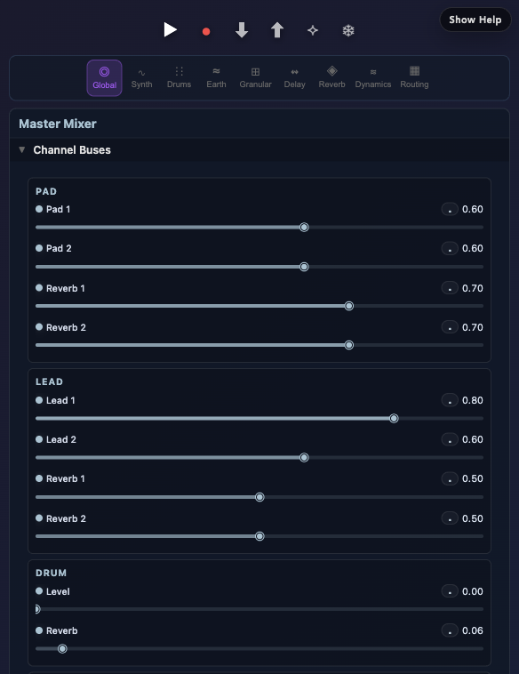
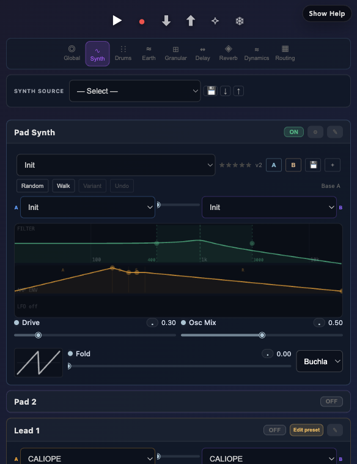
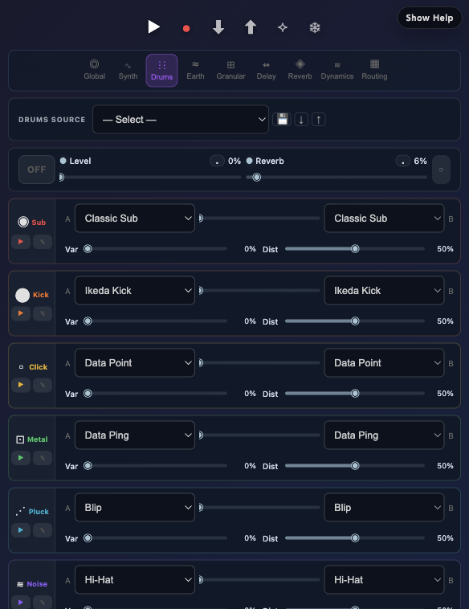
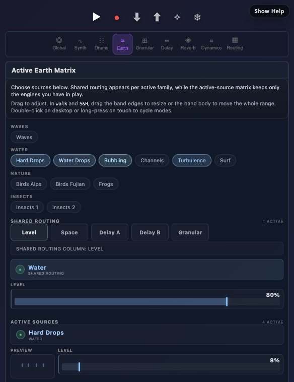
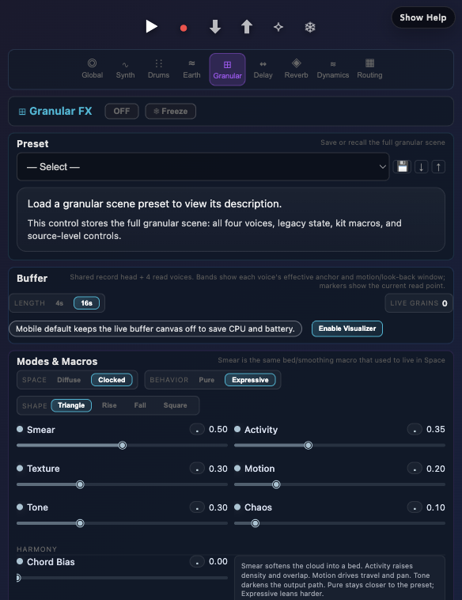
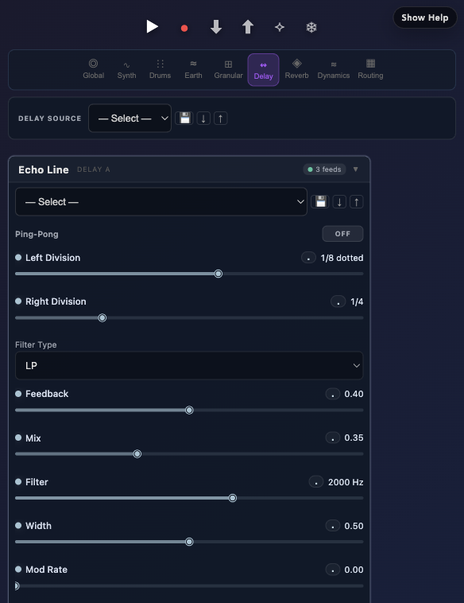
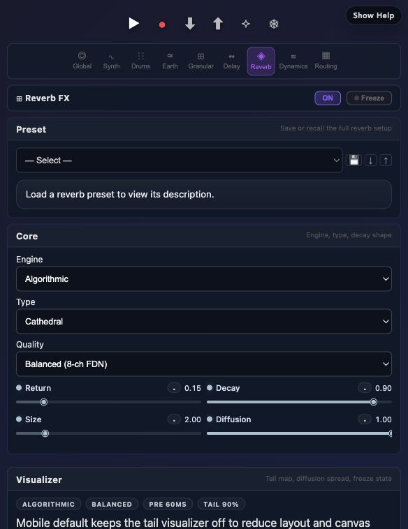
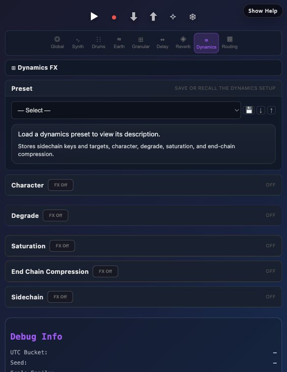
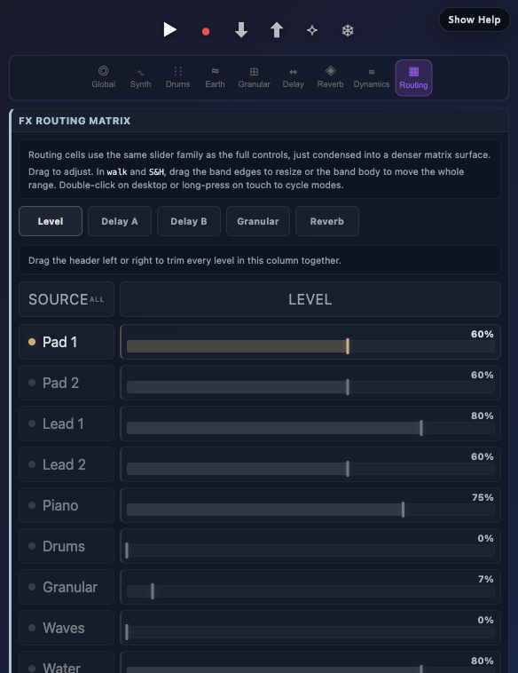
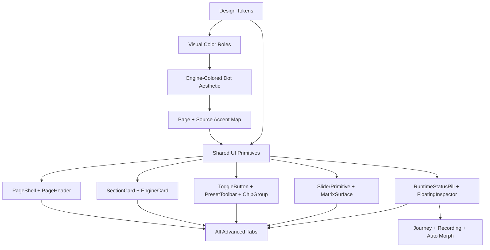

# UI Design System Audit

Date: 2026-05-03

Scope: Snowflake/simple mode plus the advanced tabs in `src/App.tsx`: Global, Synth, Drums, Earth, Granular, Delay, Reverb, Dynamics, and Routing.

Evidence captured from the running Vite app at `http://127.0.0.1:5175/`. Screenshots are stored in `docs/ui-audit/screenshots/`.

Reproduction recipe:

1. Run `npm run dev -- --host 127.0.0.1 --port 5175`.
2. Capture the listed screens from `http://127.0.0.1:5175/` at a desktop viewport near `1440x1100`.
3. Keep the screenshot names in the Evidence Snapshot table stable so `docs/ui-audit/index.html` continues to render the same artifact set.
4. Re-run `npm run type-check` after any implementation changes that follow from this audit.

## Executive Summary

The app already has a strong visual language: dark instrument panels, compact music-production controls, pale blue slider rails, restrained borders, and page-specific accents. The main issue is not lack of design direction. It is fragmentation: the same tokens, card types, preset controls, toggles, source bars, and helper copy are implemented repeatedly with small differences across pages.

The fastest path to unification is to make Reverb/Granular/Dynamics the canonical advanced-tab pattern, then migrate the older and special-purpose pages toward shared primitives:

- `PageShell`
- `PageHeader`
- `PresetToolbar`
- `SectionCard`
- `EngineCard`
- `ToggleButton`
- `ChipGroup`
- `MatrixSurface`
- `ControlHint`

## Evidence Snapshot

| Surface | Screenshot |
| --- | --- |
| Snowflake/simple |  |
| Global |  |
| Synth |  |
| Drums |  |
| Earth |  |
| Granular |  |
| Delay |  |
| Reverb |  |
| Dynamics |  |
| Routing |  |

## Current Design Inventory

### Core Tokens

The same token block is copied into most page CSS files:

- `--bg-base: #1a1a2e`
- `--bg-surface: rgba(15, 25, 40, 0.95)`
- `--bg-input: rgba(0, 0, 0, 0.3)`
- `--bg-control: rgba(255,255,255,0.08)`
- `--border-subtle: rgba(255,255,255,0.1)`
- `--text-primary: #e0e0e0`
- `--text-secondary: #9ca3af`
- `--accent-primary: #a5c4d4`
- `--radius-sm: 6px`
- `--radius-md: 8px`
- `--radius-lg: 12px`

Drift found:

- `global.css` uses a larger type scale for `--font-xs` and `--font-sm` than most pages.
- `dynamics.css` omits `--bg-elevated`, `--border-accent`, `--radius-lg`, and `--font-lg`.
- `routing.css` changes border opacity and muted text values.
- `App.tsx` and several page components still carry many inline colors and component styles.

### Measured Style Spread

| Metric | Current count | Audit read |
| --- | ---: | --- |
| Raw color expressions | 700 unique values | Too many one-off accents, opacity variants, and inline literals |
| Border radius values | 24 unique values | Mostly tokenized, but still scattered one-offs |
| Font-size values | 49 unique values | Small-control pages use many micro sizes below the token scale |
| Page CSS files | 12 | Page scoping is clear, but tokens are duplicated per page |

## Color Scheme Unification Map

The app should keep page-specific musical identity and page-specific engine logic. Journey is the aesthetic reference, not the behavioral model. Borrow its palette, glass overlays, warm cream structure, soft glow, circle indicators, and greyed-out inactive treatment; then apply those visuals to each page's existing enable, freeze, mute, solo, engine, and routing logic.

The dashboard examples should show muted in-app usage, not bright palette gradients: dark card surfaces, subtle accent rails, low-alpha fills, compact chips, and slider tracks.

### Journey-Inspired Palette + Visual Treatments

These become the canonical aesthetic vocabulary for unification. They do not require pages to adopt Journey's runtime rules, state machine, or interaction model.

| Visual treatment | Token | Journey source | Use across the app |
| --- | --- | --- | --- |
| Runtime glass | `--k-type-glass` | `rgba(20,20,35,0.5)` | Top runtime pill, floating inspectors, bottom help dock, transient live overlays |
| Warm structure | `--k-type-warm` | `#E8DCC4` and `rgba(232,220,196,0.3)` | Glass text, borders, separators, relationship map lines, connection labels |
| Engine-colored active dot | `--k-dot-active` from `--k-source-*` / `--k-page-*` | Journey circle/glow treatment, hue from engine | Visual ON/active indicator for whatever each page already treats as enabled or active |
| Journey sage accent | `--k-type-stable` | `#7B9A6D` | Journey/Snowflake/organic accent, not a universal ON color |
| Ice focus glow | `--k-type-focus` | `#B8E0FF` and `rgba(220,235,255,0.95)` | Focused object, morphing surface, selected visualizer handle, active graph node where that logic already exists |
| Violet range accent | `--k-type-range` | `#8b5cf6` | Dual/range badges, secondary range thumbs, A/B or min/max affordances |
| Soft remove accent | `--k-type-remove` | `#C4724E` | Local remove/delete actions in popovers, destructive inspector actions |
| Neutral utility | `--k-type-utility` | Existing pale blue `#a5c4d4` | Generic sliders, routing utility chrome, neutral focus, unassigned matrix cells |
| Off/disabled | `--k-type-off` | Muted text/off dots | Disabled controls, off states, unavailable rows, inactive indicators |

The dot is an aesthetic treatment, not a Journey logic import. If a page already has an enable/power action, it can use a clickable engine-colored dot. If a dot only reports activity, it should be read-only. OFF/inactive uses the same circle geometry in muted grey with no glow. Dots should not become static decoration.

### Current Page Accents

| Surface | Muted example color | Proposed role | Target token |
| --- | --- | --- | --- |
| App navigation | Purple `#a855f7` used at low alpha fills | Active app navigation only | `--k-accent-nav` |
| Global | Pale blue `#a5c4d4` plus harmony indigo | Global/system control | `--k-page-global` |
| Synth | Pad editor blue `#4a9eff`, with the existing Pad visual trace palette | Sound-source family accents | `--k-page-synth` plus pad/lead/piano accents |
| Drums | Muted lavender `#a78bca`, with per-voice colors | Rhythm/source family accents | `--k-page-drums` plus voice accents |
| Earth | Muted water blue `#6f9fcf` plus source colors | Natural texture family accents | `--k-page-earth` plus source accents |
| Granular | Muted cyan `#5eb7c6` | Granular page identity | `--k-page-granular` |
| Delay | Soft blue `#aebce0` | Delay page identity and A/B lines | `--k-page-delay`, `--k-delay-a`, `--k-delay-b` |
| Reverb | Muted violet `#8b79c8` | Reverb page identity | `--k-page-reverb` |
| Dynamics | Muted amber `#c59a47` plus module accents | Dynamics page identity plus module states | `--k-page-dynamics` plus module accents |
| Routing | Pale blue `#a5c4d4` | Utility/matrix surface | `--k-page-routing` |
| Snowflake/simple | Muted cream `#cfc3ab` plus sage/slate variants | Immersive performance mode palette | `--k-snowflake-*` |

### Page Accents Under The Color Types

Page/source accents remain useful and should define engine identity. For example, Reverb can stay violet for page chrome and its active dot. A Kick voice can use its kick color for its active dot. Shared Journey-inspired treatments still apply visually: focus glow uses ice, range accents use violet, remove actions use rust, and inactive controls use the greyed-out treatment.

### Canonical Visual Roles

| Role | Token | Color | Use |
| --- | --- | --- | --- |
| Runtime glass | `--k-type-glass` | Journey glass | Status pill, FloatingInspector, bottom hover help |
| Warm structure | `--k-type-warm` | Journey cream | Glass borders/text, graph lines, connection rows |
| Engine active dot | `--k-dot-active` | Current engine/source color | Dot aesthetic for page, engine, voice, module, and source active states |
| Journey sage accent | `--k-type-stable` | Journey sage | Journey/Snowflake/organic accents when no engine color applies |
| Focus glow | `--k-type-focus` | Journey ice/snow | Focused object, morphing surface, selected handles |
| Range accent | `--k-type-range` | Journey violet | Range badges, second range thumb, A/B min/max |
| Soft remove accent | `--k-type-remove` | Journey soft remove | Local remove/delete inside inspectors |
| Utility/neutral | `--k-type-utility` | App pale blue | Neutral sliders, routing utility, unassigned matrix cells |
| Off/disabled | `--k-type-off` | Muted slate | OFF, unavailable, muted, inactive |
| Page identity | `--k-page-*` | Page-specific | Page headers, section accents, selected local chips |
| Source identity | `--k-source-*` | Engine/source-specific | Voice rails, source dots, matrix row markers, visual traces |

### Color Drift to Fix

- Purple currently means active navigation, Reverb, Dynamics degrade, evolve, range controls, and some drum states. Keep `--k-accent-nav` for app navigation, use `--k-type-range` for range/dual meaning, then move page/module purple to page-scoped or source-scoped tokens.
- Cyan currently means Granular, Dynamics, Delay, focus, and general emphasis. Use `--k-type-utility` for neutral controls, `--k-type-focus` for live focus/morphing, and `--k-page-granular`, `--k-page-dynamics`, and `--k-page-delay` for page identity.
- Green currently appears as enabled state and source identity. Stop using green as the universal ON color. Active dots should inherit the current engine/source color; green should appear only when the engine/source identity is actually green or when Journey/Snowflake uses sage as part of its own aesthetic.
- Pale blue is used for sliders, utility accents, and page identity. Keep it as the neutral control accent and avoid using it as the unique identity for pages that already have stronger domain colors.
- Snowflake/simple mode has an intentional immersive palette, but its control chrome should still reference shared app tokens.
- Avoid full-saturation color blocks in documentation examples. Show accent color through rails, borders, chips, and low-alpha fills so the examples match the actual app.

### Color Migration Rules

1. Replace hard-coded literals with shared visual tokens first: `--k-type-glass`, `--k-type-warm`, `--k-dot-active`, `--k-type-focus`, `--k-type-range`, `--k-type-remove`, `--k-type-utility`, and `--k-type-off`.
2. Map old ON/OFF visuals to the dot aesthetic only when it fits the page's existing control logic: `--k-state-on -> --k-dot-active` where `--k-dot-active` resolves to the current engine/source color; `--k-state-off -> --k-type-off`. Map existing freeze/morph/focus visuals to `--k-type-focus`, range/dual visuals to `--k-type-range`, and local remove/delete visuals to `--k-type-remove`. Keep record/danger as a stronger exception if it needs immediate alarm.
3. Add page-level accent tokens second: `--k-page-global`, `--k-page-synth`, `--k-page-drums`, `--k-page-earth`, `--k-page-granular`, `--k-page-delay`, `--k-page-reverb`, `--k-page-dynamics`, and `--k-page-routing`.
4. Let source/voice colors feed active dot styling. A source rail and its active dot should match; inactive/off should be greyed out using `--k-type-off`.
5. Use opacity variants from tokenized RGB channels instead of writing new `rgba(...)` values for every border, fill, and hover state.
6. Let page accent color appear in the page header, section border highlights, focus rings, and selected local chips. Do not use it for every control on the page.
7. Do not use page-accent gradients as title/header washes or matrix cell/column washes. Page headers and matrix surfaces should use quiet solid glass/rgba surfaces; show identity through accent text, borders, source dots, chips, rails, and selected outlines only. Routing is the canonical matrix baseline: neutral grid, row/source identity markers, no destination-column tint.

### Page -> Sound Engine Color Structure

Preset L1/L2/L3 is useful for understanding product hierarchy and control anatomy, but it should not be the color rule. The main color structure should be page identity first, then sound-engine identity. Single-engine pages can use the same color for page and engine. Multi-engine pages should give each sound engine a stable color that follows that engine everywhere it appears, including engine cards, selectors, source chips, visual traces, and routing/matrix representations.

| Color layer | Example scopes | Color rule |
| --- | --- | --- |
| Page identity | `synth`, `drums`, `earth`, `granular`, `delay`, `dynamics`, `reverb`, `routing` | One muted page color for page chrome, headers, selected page tabs, and section accents |
| Single sound engine | Reverb core, simple single-engine pages | Engine color can match the page color because the page and sound source are the same unit |
| Multiple sound engines | Synth Pad/Lead/Keys, Drum Kick/Membrane/Noise, Earth Water/Insects/Weather, Dynamics modules | Each engine gets a stable color that stays consistent across page cards, routing matrices, source chips, and visual traces |
| State visuals | ON, OFF, record, warning, freeze, solo, mute | Keep each page's logic; apply shared dot, focus, range, remove, and inactive visual treatments where appropriate |

The Pad Synth visual already has a strong and likable color language: Pad 1 card/slot A blue `#4a9eff`, Pad 2 purple `#8b5cf6`, Filter A green `#10b981`, Filter B blue `#3b82f6`, and amp/mod envelope amber `#f59e0b`. Keep those as the canonical Synth visualization colors. Use them as thin traces, slot tags, rails, and low-alpha fills rather than large bright panels.

Recommended map:

| Page | Sound engines and colors |
| --- | --- |
| Synth `#4a9eff` | Pad family `#4a9eff` with existing Pad visual colors; Lead family `#f59e0b`; Keys/piano `#e7c87f` |
| Drums `#a78bca` | Sub `#c05c5c`, Kick `#c47a4d`, Click `#c4a94b`, Metal `#6eaa7d`, Pluck `#5aa8b8`, Noise `#8b79c8`, Membrane `#b85a73` |
| Earth `#6f9fcf` | Water `#6f9fcf`, Insects 1 `#6eaa7d`, Insects 2 `#c59a47`, Weather/Nature `#aebce0` |
| Reverb `#8b79c8` | Single-engine page: Reverb engine can use the Reverb page color; modulation/tone/shimmer can use small secondary accents |
| Granular `#5eb7c6` | Voice 1 `#5eb7c6`, Voice 2 `#6aa89a`, Voice 3 `#8b79c8`, Voice 4 `#c59a47`, Legacy `#6f7888` |
| Delay `#aebce0` | Echo Line `#aebce0`, Clocked Space `#8b79c8`, Lead Delay `#c59a47`, Cross-feed `#6aa89a` |
| Dynamics `#c59a47` | Sidechain `#5eb7c6`, Character `#6eaa7d`, Degrade `#8b79c8`, Saturation `#c59a47`, End Chain `#b98a5a` |
| Routing/Global `#a5c4d4` | Utility surfaces stay neutral; assigned source/engine chips use the originating engine color |

Engine colors should appear as small identity details: rails, source dots, compact chips, waveform traces, matrix row markers, selected-engine outlines, and routing assignment chips. Parameter groups below an engine should use tonal variants of the engine color at low alpha instead of adding another hierarchy level.

### Multi-Engine Color Strategy: Drums

Drums needs a layered color model because it has page chrome, seven voice engines, and four sequencer lanes. These should not all share the same meaning.

| Layer | What it colors | Token family | Rule |
| --- | --- | --- | --- |
| Page identity | Drums header, page-level bars, selected local tabs | `--k-page-drums` | One muted lavender/purple accent for the overall page |
| Voice identity | Voice card left rails, voice names, trigger flash, source chips, active dot | `--k-drum-*` | Stable per-voice colors; enabled/active visuals can use the voice color |
| Sequencer lane identity | Seq 1-4 lane tabs, lane headers, lane playhead details | `--k-seq-lane-*` | Separate from voice colors because a lane can target multiple voices |
| State visuals | ON/OFF, mute, solo, record, frozen, warning | Dot treatment, `--k-type-*`, alarm exceptions | Keep the existing drum logic; enabled/active inherits voice color, inactive/off greys out, focus/range/remove/alarm states use shared treatments |

Proposed muted drum voice tokens:

| Voice | Current color | Muted target token | Use |
| --- | --- | --- | --- |
| Sub | `#ef4444` | `--k-drum-sub: #c05c5c` | Low-end voice rail and trigger flash |
| Kick | `#f97316` | `--k-drum-kick: #c47a4d` | Kick voice rail and source badge |
| Click | `#eab308` | `--k-drum-click: #c4a94b` | Click/transient voice rail |
| Metal | `#22c55e` | `--k-drum-metal: #6eaa7d` | High metallic/FM voice rail |
| Pluck | `#06b6d4` | `--k-drum-pluck: #5aa8b8` | Modal/pluck voice rail |
| Noise | `#8b5cf6` | `--k-drum-noise: #8b79c8` | Noise texture voice rail |
| Membrane | `#e11d48` | `--k-drum-membrane: #b85a73` | Physical/membrane voice rail |

Drum implementation rule: voice color should appear as a thin rail, small source dot/chip, active dot treatment, selected voice outline, and trigger flash. Sliders and generic controls should remain neutral unless they are inside an active voice card, where the thumb/focus ring may borrow the voice accent at low alpha.

Sequencer implementation rule: keep `Seq 1-4` lane colors independent from drum voices. If a lane is assigned to a voice, show the voice as a chip inside the lane instead of repainting the whole lane. This keeps lane identity stable while still showing source assignment.

## Pre-Implementation Decision Checks

Before implementing the unified UI, approve the scope and exception rules. The remaining decisions are less about picking one color or one component, and more about deciding when the shared language should override page personality.

Decision gate:

| Step | Check | Why it matters |
| --- | --- | --- |
| 1. Snapshot | Capture every page in default, active, edited, disabled, and mobile states | Avoid designing against only the prettiest or most familiar page |
| 2. Compare | Place Reverb, Granular, Journey, Synth, Drums, Routing, and Dynamics side by side | Reveals which patterns are reusable and which are domain-specific |
| 3. Decide | Approve shared primitives, page exceptions, color meaning, and density rules | Prevents implementation from becoming a series of one-off taste calls |
| 4. Pilot | Implement one ordinary page and one dense/matrix page first | Proves the system before migrating everything |

Checks for the user to decide:

| Decision area | What to check | Recommendation |
| --- | --- | --- |
| Aesthetic vs logic boundary | Confirmed | Journey contributes colors, glass, dots, and glow only. Each page keeps its own ON/OFF, freeze, mute, solo, and engine behavior |
| Page personality boundaries | Confirmed | Source/page accents belong in headers, selected chips, source rails, visual traces, matrix row identity, and not every control |
| Dot and glow rules | Check Journey pill, active nodes, engine ON states, morph progress, selected rows, and static labels | Clickable dots are allowed only where the page already has a toggle; read-only dots report activity; both use grey/no-glow for inactive |
| Page -> Sound Engine colors | Confirmed direction | Preset hierarchy can help explain structure, but color should primarily follow page identity and sound-engine identity; engine colors must stay consistent in routing/matrix representations |
| Slider and matrix behavior | Check drag, keyboard, reset, disabled, walking/randomized, range/dual, ghost preview, and value readout | Keep `SliderPrimitive` and `MatrixSurface`; migrate native ranges only after behavior matches |
| Dense vs ordinary pages | Compare Reverb/Granular against Drums/Routing/Synth | Build a two-page pilot before migrating all pages |
| Typography and density | Check label/value sizes, chip labels, matrix text, page headers, and helper text on desktop and mobile | Use one compact type scale and spacing scale; dense views can compress spacing, not invent a separate style |
| Accessibility | Check contrast on low-alpha fills, visible focus, hit targets, reduced motion, and color-blind readability | Treat this as a design decision before tokenizing final colors |
| Visualizers | Check Pad, Journey, Snowflake, Routing, and any canvas-heavy surfaces | Standardize chrome, handles, grid, labels, hover, and disabled states; keep trace colors source-specific |
| Migration safety | Save before/after screenshots and token counts | Watch for broken layout, over-bright accents, lost source identity, unreadable disabled states, and visualizer drift |

Remaining user decisions before implementation:

| Decision | What needs input | Suggested default |
| --- | --- | --- |
| Exact sound-engine colors | Approve or adjust the final engine palette for Synth engines, Drum voices, Earth sources, Granular voices, Delay lines, Dynamics modules, and single-engine pages | Start from the current audit palette and only change colors that feel wrong in context |
| Routing/matrix color behavior | Decide how much engine color appears when a sound engine is represented inside routing or matrix surfaces | Neutral matrix surface plus engine-colored chip/dot/rail/outline; avoid recoloring whole cells |
| Dot label treatment | Decide whether active/inactive dots stand alone or keep short labels like ON/OFF, M, S, Freeze beside them | Keep labels where ambiguity or accessibility matters; dots alone only in dense repeated rows |
| Two-page pilot | Choose the first ordinary page and first dense/matrix page to implement | Reverb or Granular for ordinary; Drums or Routing for dense |
| Visualizer reuse boundary | Decide which Journey/Pad visualizer aesthetics should become shared chrome and which should remain source-specific | Share frame/grid/handles/hover/readout; keep trace colors and motion source-specific |
| Help pattern | Confirm where the translucent bottom help/dock appears and whether it is hover-only, dismissible, or persistent | Use it only for complex matrix/routing first-use guidance; keep ordinary pages quiet |

Choose A/B/C for each remaining decision:

| Decision | Option A | Option B | Option C |
| --- | --- | --- | --- |
| 1. Exact engine colors | Current muted map: preserves the existing app identity with softened values | **Selected: Journey-softened map.** Pulls colors toward ice, sage, cream, violet, and rust | High-separation map: stronger scanability for cards, matrices, and routing |
| 2. Routing/matrix color amount | **Selected: Chip + dot only.** Neutral grid with small engine identity markers | Rail + outline: colored row rail and selected-cell outline | Low-alpha fill: assigned cells get subtle engine color, with the most visual weight |
| 3. Dot labels | Dot + short label for clarity and accessibility | Dense dot only for repeated rows and learned patterns | **Selected: Dot + hover/detail dock** for complex pages that need extra context |
| 4. Two-page pilot | **Selected: Reverb + Drums.** Single-engine page plus multi-engine voice page | **Selected: Granular + Routing.** Advanced controls plus the hardest matrix decision | Reverb + Routing: low-risk ordinary page plus high-impact dense surface |
| 5. Visualizer boundary | Shared frame only: Pad, Reverb, and Granular all get the same dark frame/grid/title chrome, but the drawing inside stays custom | **Selected: Frame + handles.** Also standardize hover readouts, draggable handle dots, focus rings, disabled state, and inspect behavior while keeping source-specific drawings | Frame + legend system: also standardize mini legends, dot placement, and readout layout while traces remain source-specific |
| 6. Help dock behavior | Hover-only bottom dock: hidden until hovering/focusing a complex matrix, visualizer, or dense slider; appears at the bottom of that page area | **Selected: Dismissible bottom dock.** Appears on first use at the bottom of complex pages; after dismissal, the existing Show Help / Help / ? trigger brings it back | Persistent soft dock: always pinned near the bottom edge of complex matrix pages with transparency; not used on ordinary pages |

Current selected direction: `1B, 2A, 3C, 4A+B, 5B, 6B`.

Visualizer examples:

| Option | What would match | What would stay unique |
| --- | --- | --- |
| 5A | The frame, dark grid, title placement, disabled overlay, and canvas border | Pad's waveform, Reverb's tail graph, Granular's cloud, Routing's signal lines |
| 5B | Everything in 5A plus hover readouts, draggable handle dots, focus/active states, and inspect behavior | The data shape, trace color, animation, and page-specific visual meaning |
| 5C | Everything in 5B plus legend placement, activity dots, readout layout, and mini labels | The actual trace rendering and motion model |

Decision `5B` is additive, not a simplification. The Pad Synth visual must keep its existing ADSR, filter, envelope, cutoff, and draggable graph interactions. Other visualizers should gain comparable interaction when it is useful: Reverb tail points, Granular grain/focus handles, Routing signal/node inspection, and future source visuals should share hover readouts, focus states, handle styling, and disabled behavior without sharing the same sound logic or trace rendering.

Help dock placement:

| Option | Where it appears | Best fit |
| --- | --- | --- |
| 6A | Bottom of the active page area only while hovering/focusing a complex control | Users who already know the app and only need occasional hints |
| 6B | Bottom of complex pages on first use or when Help is pressed, then dismissible | Routing, Earth matrix, Drums voice grids, Granular advanced controls |
| 6C | Persistently pinned near the bottom edge of complex matrix pages with transparency | Very dense pages where guidance should stay visible while editing |

For `6B`, dismissed help is brought back through the same small `Show Help`, `Help`, or `?` control already present in page headers or complex panels. The dismissed state should be remembered per page or per complex surface, not globally forever. A user can reopen it by pressing `Show Help` / `Help` / `?`, and focusing/hovering a control can swap the dock content to that parameter's explanation.

This is the confirmed evolution of the current `Show Help` behavior. Instead of every parameter expanding its own text by default, parameter-level help should feed the contextual dock or a compact hover detail. Ordinary pages can keep short hints; dense pages should avoid long inline help blocks that push controls around.

Final checks before implementation:

User-facing decisions still worth confirming:

| Area | Status | Decision |
| --- | --- | --- |
| Pilot order | Confirmed | Two waves: Reverb + Drums first, then Granular + Routing |
| State priority | Confirmed | Disabled/off, danger/record, warning, selected/focus, then engine active color |
| Engine palette freeze | Confirmed | Freeze the Journey-softened palette for the pilot; adjust only after side-by-side screenshots show a mismatch |
| Help memory | Confirmed | Remember dismissed help per page or per complex panel, with `Show Help` / `Help` / `?` always available to reopen |
| Visualizer eligibility | Confirmed | Only visualizers with real editable or inspectable data get 5B handles/readouts; never add fake handles |
| Migration tolerance | Confirmed | Shared tokens/primitives first, pilot pages second, remaining pages after screenshot review |

All user-facing pre-implementation decisions are now confirmed.

State priority means that when one element has more than one meaning, the strongest meaning controls the visual treatment. Confirmed order: disabled/off, danger/record, warning, selected/focus, then engine active color.

Examples:

| Case | Result |
| --- | --- |
| Kick is orange but the voice is off or unavailable | The dot becomes grey with no glow; engine color does not show |
| A control is recording or destructive while also selected | Record/danger styling wins so the risky state is never hidden |
| A focused control has a warning | Warning styling beats normal focus or active color |
| A Pad handle is being edited with no warning | Focus/selection styling can show on top of Pad identity |
| A normal active engine has no stronger state | Engine color appears as the normal musical identity |

Implementation checks Codex can own:

| Check | What to verify |
| --- | --- |
| Snapshot baseline | Default, active, edited, disabled, help-open, and mobile states before UI changes |
| Token inventory | Hard-coded colors, radii, font sizes, duplicate page CSS, and inline styles |
| Behavior parity | Current slider, matrix, visualizer, toggle, preset, help, drag, keyboard, reset, focus, and disabled behavior |
| Accessibility | Contrast, keyboard focus, hit targets, reduced motion, mobile overflow, color-only state communication |
| Regression screenshots | Before/after comparison for each pilot page so source identity and dense layouts survive |
| Type/test check | Run repo checks after each implementation wave and fix regressions before expanding scope |

Implementation defaults that should not need new product decisions unless a prototype feels wrong: token naming, low-alpha opacity variants, type scale, spacing scale, radius scale, focus rings, contrast checks, reduced-motion support, and screenshot regression baselines.

## Beyond Color: UI Unification Checklist

Two slider families can stay, but they should be described from the actual implementation:

- `SliderPrimitive`: the shared parameter slider used by normal controls. It has a label/value header, optional hero dot, mode pill (`.`, `~`, `||`), an 18px interaction rail, 4px track/fill, circular thumb, and walk/sample-hold range bands.
- `MatrixSurface` cell slider: the dense Routing/Earth surface. It is a rectangular cell with a 14px track/fill, vertical indicator, optional min/max edges, tiny mode/value readout, and a row-accent color.

The older native `input[type=range]` controls that still appear in sequencer/evolution pockets should be treated as migration candidates or explicit legacy exceptions, not a third design-system slider.

| Area | Why it matters | Rule to standardize |
| --- | --- | --- |
| Page structure | Pages currently start with different rhythms: some go straight to cards, some start with preset bars, some lead with long instructions | Every advanced tab should use `PageShell -> PageHeader -> PresetToolbar -> ContentGrid` |
| Preset placement | Synth, Drums, Delay, Reverb, and Dynamics all expose presets differently | Source/page presets belong in one `PresetToolbar`; engine presets live inside `EngineCard`; A/B morph controls use one compact row |
| Card grammar | Some pages use cards for sections, others use nested cards, custom panels, or matrix blocks | Use `SectionCard` for ordinary controls, `EngineCard` for source/voice engines, and avoid cards inside cards |
| Control taxonomy | Buttons, chips, tabs, toggles, selects, and icon buttons vary by page | Define `ToggleButton`, `IconButton`, `SegmentedControl`, `ChipGroup`, `TabStrip`, `Select`, `NumericStepper`, `SliderPrimitive`, and `MatrixSurface` once |
| State language | ON/OFF, armed, disabled, mute, solo, record, freeze, edit, dirty, saving, and warning states are visually inconsistent | Keep page behavior intact; give comparable states a consistent visual treatment and label convention |
| Typography | The app has many micro font sizes and label styles | Use a compact type scale with clear roles: page title, section title, control label, value, helper text, metadata |
| Spacing and density | Dense musical tools need compactness, but spacing currently differs per page | Use a spacing scale: 4, 6, 8, 10, 12, 16. Dense mode can compress gaps, not invent new values |
| Visualizations | Pad visuals feel good because bright traces sit inside restrained dark chrome | Standardize canvas chrome, grid lines, labels, handles, hover states, and trace thickness; allow brighter data traces inside visualizers |
| Help and copy | Earth and Routing carry persistent instructional text, while other pages rely on compact UI | Move long instructions into `SliderHelpOverlay`; keep only short contextual hints on the page |
| Interaction affordances | Edit modes, advanced tiers, draggable controls, and disabled elements do not always communicate the same way | Standardize hover, focus, pressed, drag, edit, disabled, and invalid states across all primitives |
| Responsive behavior | Compact pages risk overflow or cramped touch targets | Define mobile grid collapse, horizontal scrolling only for true matrices, and minimum touch targets for toolbar actions |

Slider rule: keep `SliderPrimitive` and `MatrixSurface` distinct. `SliderPrimitive` is for ordinary parameter rows, morph rows, mixer strips, and engine internals where label/value context matters. `MatrixSurface` is for dense row/column editing where the cell itself is the control. Both families should share disabled, focused, edited, walking, sample-hold, ghost/preview, reset, and touch-drag behavior.

## Standard Choice Board

Use this as the design decision board. The options below are not invented patterns; they are based on element families currently present in the app.

Source examples checked for this board: `reverb-global-bar`, `granular-global-bar`, `dynamics-global-bar`, `reverb-section-card`, `granular-section-card`, `synth-card`, `voice-card`, `routing-card`, `SliderPrimitive`, `MatrixSurface`, `app-select`, `sc-preset-select`, `sc-lfo-preset-select`, `synth-source-select`, `seq-preset-select`, `seq-ov-select`, and the remaining native range/input pockets in sequencer/evolution controls.

Chosen direction:

- Page header: use A everywhere. Every advanced page gets the global bar header: title, compact metadata, and page-level actions.
- Cards: use A for normal content cards and C for matrices. Engine cards should become a variant of A with optional source accent, not a separate card grammar.
- Preset controls: keep A, B, and C because they serve different levels. Unify their internal styling: same select shell, slot chip, action button, morph slider, save/dirty state, focus ring, disabled state, and typography.
- Power toggles and state buttons: borrow Journey-style dot/glow aesthetics where the existing page logic already has ON/OFF or activity. Single-engine pages like Reverb can show page-level dots. Multi-engine pages like Synth, Drums, and Dynamics can show engine/module dots inside each card. Dense rows, layers, lanes, mute/solo-adjacent states, and locks use tiny dense controls.
- Choice controls: keep A and C. Use chips for mode options and source filters; use tabs for lanes, views, and matrix navigation. Treat B as a legacy/special mode row unless a control truly needs equal-width mutually exclusive buttons.
- Sliders: keep `SliderPrimitive` and `MatrixSurface`. Migrate native ranges to `SliderPrimitive`.
- Selects and inputs: keep density variants, but unify styling. They can have different widths and heights by context, but they should share radius, border, background, type, focus, hover, disabled, and menu treatment.
- Help and copy: use A by default. Use B as a translucent bottom hover/dock panel for complex matrix guidance instead of a heavy always-visible instruction card.
- Visualizers: this is separate from Help. The recommendation is shared visualizer chrome: same dark frame, grid, label, handle, hover, and disabled styling, while each source keeps its own trace colors and motion.

| Element family | Option A | Option B | Option C | Decision needed |
| --- | --- | --- | --- | --- |
| Page header | `reverb-global-bar` / `granular-global-bar`: compact page title plus page-level actions | `routing-card-header`: page title inside the first card | Legacy/no page header: page starts with toolbar or cards | Pick the default advanced-page header. Suggested: A |
| Cards | `reverb-section-card` / `granular-section-card`: no left rail, subtle border variants | Engine/source accent variant folded into A, not a separate grammar | `routing-card` / Earth active matrix: dense matrix surface container | Standard: A for cards, C for matrices |
| Preset controls | `reverb-preset-toolbar` / `granular-preset-toolbar`: source/page preset strip | Synth/Drums A/B morph row inside engine cards | Global/state morph panel with larger slot cards and auto-cycle controls | Standard: A, B, and C stay; unify anatomy and styling |
| Toggles | Page dot treatment for single-engine pages: Reverb/Granular/Delay-style enable | Engine/module dot treatment for multi-engine pages: Synth, Drums, Dynamics modules | Tiny dense dot or compact state button: Earth layer toggle, tension lock, lane mute/solo | Standard: all three by scope; active color inherits the engine/source, inactive greys the dot |
| Choice controls | `granular-chip-group`: labeled chip group | Equal-width segmented rows only for true mode switches | Sequencer tabs/lane tabs: dense tab strips with lane color | Standard: A mode/source choices, C navigation; B rare/special |
| Sliders | `SliderPrimitive`: label/value/mode/rail/thumb | `MatrixSurface` cell slider: rectangular dense fill and readout | Native `input[type=range]`: currently in sequencer/evolution pockets | Standard: A and B; migrate C to A |
| Selects + inputs | Full labeled select: `app-select` and preset manager/dropdown controls | Compact engine select: `sc-preset-select`, `sc-lfo-preset-select`, `synth-source-select` | Dense sequencer input/select: `seq-preset-select`, `seq-ov-select`, `seq-clock-select`, short numeric inputs | Standard: keep density variants; unify visual styling |
| Help and copy | `SliderHelpOverlay` plus short contextual hint | Translucent bottom hover/dock panel for complex matrix guidance | No visible help | Standard: A default, B for complex matrix first-use guidance |
| Visualizers | Shared dark chrome and grid | Domain-specific trace colors/motion | Shared handles, labels, and hover states | Standard: shared chrome plus handles/states; traces and sound logic remain source-specific |

## Journey UI Elements To Reuse

Journey has several strong interface ideas that should become shared primitives instead of staying trapped in the Journey page.

Source examples checked: `DiamondJourneyUI`, `JourneyModeView`, and the matching Journey status bar inside `SnowflakeUI`.

Journey palette adoption:

| Journey token | Source value | Use across the app | Do not use for |
| --- | --- | --- | --- |
| Runtime glass | `rgba(20, 20, 35, 0.5)` | Top runtime pill, floating inspectors, bottom help dock, transient live-state overlays | Normal section cards or dense card backgrounds |
| Warm cream text | `#E8DCC4` | Glass overlay text, relationship-map labels, connection labels, subtle runtime copy | Replacing the main app body text everywhere |
| Warm cream border | `rgba(232, 220, 196, 0.3)` | Glass panel borders, popover separators, runtime pill borders, relationship-map outlines | Every control border; keep ordinary controls cooler and quieter |
| Sage active | `#7B9A6D` | Journey/Snowflake stable activity, organic/ambient fallback where no engine/source color applies | Universal ON logic or replacing engine/source color |
| Ice active | `#B8E0FF` / `rgba(220, 235, 255, 0.95)` | Morphing, currently focused live object, selected graph node, runtime progress, active visualizer handles | Replacing source accent colors like Pad, Drums, Earth, Reverb |
| Violet range | `#8b5cf6` | Dual/range mode badge, secondary morph handle, advanced range affordance | Page accent default or general navigation overload |
| Soft remove | `#C4724E` | Destructive actions inside floating inspectors, like Journey Remove | Global error state; use stronger warning/error tokens where needed |

Glowing circle indicator standard:

- Use a 6-8px dot/glow treatment where the page already has ON/OFF, active, current, selected, or live-state logic. Active uses the current engine/source color with same-color glow. Inactive uses muted grey with no glow. Disabled uses the grey dot at lower opacity.
- Use a 6-8px read-only glow indicator for live state, not decoration. It should have a solid center, same-color glow, and clear off/disabled opacity.
- Use these dot aesthetics in `RuntimeStatusPill`, PageHeader runtime state, PresetToolbar dirty/saving/live morph state, EngineCard active/editing state, MatrixSurface row activity, sequencer playhead/current lane, visualizer handles, Routing source rows, Earth active source rows, Granular voice/slice assignment, and Dynamics processor activity.
- Do not add glowing dots to static labels or every card title. If everything glows, the app loses live-state meaning.

| Journey element | Actual behavior | Reuse elsewhere |
| --- | --- | --- |
| Runtime status pill | Fixed top-center glass pill shown while Journey is playing. Compact view has a phase dot, current/next preset names, and a 3px progress bar. Expanded view shows phase, current preset, phrase progress, morph progress, ending progress, time remaining, and next stop. | Create a shared `RuntimeStatusPill` for Journey, recording, global state morph, auto-cycle, sequencer playback, long-running randomization, and any page-level autonomous process. |
| Glass popup surface | Node and connection editors use translucent blur, warm cream border, 12px radius, compact type, and subtle inset glow. | Use as `FloatingInspector` for matrix cells, routing sends, sequencer steps, visualizer handles, preset metadata, and the bottom help dock. |
| Phase dot + micro progress | Journey communicates live state with a colored dot, glow, tiny progress track, and time remaining. | Use in PageHeader/PresetToolbar for active morph, freeze, recording, auto-cycle, evolving sequencers, LFO sync, and engine activity. |
| Node and connection map | Diamond outline, center halo, active node glow, connection arcs, self-loop arcs, and ghost connection lines. | Reuse only for relationship views: routing overview, modulation graph, preset family map, source-to-FX map. Do not use as decoration on ordinary parameter pages. |
| Probability rows | Outgoing connection rows show colored target dot, target name, normalized probability, and chevron. | Use for routing sends, sidechain/key-input destinations, sequencer probability lanes, drum voice outputs, and modulation destinations. |
| Dual/range mode badge | Journey uses an `↔` badge for phrase/morph range mode and supports double-click/long-press to switch single/range. | Fold into `SliderPrimitive` as a range/dual-value affordance, replacing native ranges where possible. |
| Ambient active halo | Playing/morphing states tint the background halo and center node by the current source color. | Use sparingly as active-source feedback in visualizers and selected engine headers. Avoid full-page halos inside dense advanced tabs. |
| Bottom circular nav | Journey and Snowflake share low-profile bottom circular icon navigation. | Keep for immersive canvas modes only. Advanced pages should continue to use the normal app/tab chrome. |

New standards to add:

- `RuntimeStatusPill`: compact by default, expandable on click/tap, fixed top-center only for active runtime processes. It should share Journey's blur, warm border, dot, microbar, and ellipsis aesthetics, but use the active page/source color and the page's own runtime logic.
- `FloatingInspector`: the shared version of Journey node/connection popups. It should support adjacent popovers, mobile top docking, compact labels, probability rows, and embedded `SliderPrimitive`.
- `ProgressMicrobar`: 3-4px progress bar for live state summaries. This is separate from the full `SliderPrimitive`; it is read-only telemetry, not an editable control.
- `RelationshipMap`: a shared graph language for systems made of nodes and edges. Routing, preset family trees, and modulation maps can use it; normal parameter pages should not.
- `EngineDot`: a shared circle/glow aesthetic for engine/source ON, active, selected, current, or live states. It can be clickable only when the existing control is already a toggle. Active inherits engine/source color, inactive is greyed out.
- `GlowIndicator`: a shared glowing circle aesthetic for read-only live state. It should replace one-off row dots, recording dots, spark dots, status dots, voice dots, and visualizer handle dots where those currently use different sizes, glows, or opacity rules.

Suggested adoption:

1. Put `RuntimeStatusPill` into the app shell so it can summarize Journey, recording, global morph, and sequencer/autoplay states from any page.
2. Convert the existing bottom help/dock proposal into a variant of `FloatingInspector`.
3. Replace Journey's native phrase and morph ranges with `SliderPrimitive` range mode once the primitive supports the Journey single/range behavior.
4. Reuse probability rows in Routing and Dynamics before using the graph language more broadly.
5. Standardize existing dots under `EngineDot` or `GlowIndicator`: existing ON/OFF controls can use `EngineDot`; Routing row dots, Earth status dots, Granular voice dots, Synth keyboard legend dots, sequencer spark/current dots, recording pulse, and SliderPrimitive hero dots become read-only `GlowIndicator` when they show activity rather than toggle power.
6. Keep Journey's immersive background and bottom nav local to Snowflake/Journey; borrow the palette, status, indicator, and inspector primitives, not the whole page style.

## Design System Visualization



## Consistency Heatmap

Scale: 1 = divergent, 5 = aligned.

| Page | Tokens | Layout | Cards | Controls | Helper Copy | Priority |
| --- | ---: | ---: | ---: | ---: | ---: | --- |
| Snowflake/simple | 1 | 2 | 1 | 2 | 3 | Medium |
| Global | 3 | 4 | 3 | 3 | 4 | High |
| Synth | 4 | 4 | 3 | 3 | 2 | High |
| Drums | 4 | 4 | 3 | 3 | 2 | High |
| Earth | 4 | 3 | 2 | 3 | 1 | High |
| Granular | 4 | 4 | 4 | 3 | 3 | Medium |
| Delay | 4 | 4 | 4 | 4 | 2 | Medium |
| Reverb | 4 | 4 | 5 | 4 | 3 | Low |
| Dynamics | 2 | 3 | 4 | 3 | 4 | Medium |
| Routing | 2 | 2 | 3 | 3 | 1 | High |

## Recommended Canonical Pattern

Use this hierarchy for every advanced tab:

1. App toolbar and tab bar from `App.tsx`.
2. `PageHeader`: title, page accent, engine enable/freezing/status actions.
3. Optional `PresetToolbar`: source or scene preset controls.
4. Main content: two-column or grid layout inside `PageShell`.
5. `SectionCard`: ordinary parameter sections.
6. `EngineCard`: source/voice cards that need a left accent rail.
7. `MatrixSurface`: dense routing or sequencer matrix controls.

Canonical visual rules:

- Backgrounds: app background only at shell; cards use `--surface-1`; nested controls use `--surface-2`.
- Radii: 6px controls, 8px cards, 12px page-level bars only.
- Type: keep page/body controls on a small but explicit scale instead of one-off micro values.
- Accent: selected navigation stays one global accent; page accent is used inside the active page.
- Header and matrix color: no page-title/header gradients and no matrix cell/column gradients. Keep matrix surfaces neutral; use Routing's current quiet grid as the standard.
- Copy: persistent instructions move into help overlays or compact hint rows.

## Per-Page Change Plan

### Snowflake/simple

Current: immersive standalone canvas with inline styling and separate control grammar.

Change:

- Move colors, button dimensions, shadows, and splash styles into shared tokens.
- Replace text-symbol buttons with the same icon-button primitive used by advanced mode.
- Keep the immersive Snowflake layout, but align play, preset, journey, and advanced actions to the global icon language.
- Make `Show Help` use the same button size, radius, and focus state as advanced toolbar controls.

### Global

Current: strong content structure, but uses unique card names (`mixer-card`, `presets-card`, `harmony-card`, `utility-card`) and a larger local type scale.

Change:

- Add a `PageHeader` so Global has the same top rhythm as Reverb, Granular, and Dynamics.
- Convert `mixer-card`, `presets-card`, `harmony-card`, and `utility-card` to `SectionCard`.
- Normalize `--font-xs` and `--font-sm` to the shared page scale.
- Keep the collapsible Harmony sections, but use a shared `SectionHeader` with the same chevron, padding, and hover state as Delay cards.

### Synth

Current: rich and feature-complete, but visually dense. It uses its own source preset bar, multiple synth card header styles, inline styles, and many micro font sizes.

Change:

- Replace `synth-source-preset-bar` with shared `PresetToolbar`.
- Convert Pad, Pad 2, Lead 1, Lead 2, Piano, and Keyboard sections to `EngineCard`.
- Convert advanced subareas (`Filter`, `Envelope`, `Space`, `LFO`, `Oscillators`) to nested `SectionCard` variants or a shared `SubsectionLabel`.
- Standardize the `Edit preset`, A/B, save, random, and walk controls through shared buttons/chips.
- Reduce one-off font sizes below `--font-xs`; dense controls can use a `compact` prop rather than raw values.

### Drums

Current: closely related to Synth and already has a useful source/pattern flow, but voice cards and sequencer controls use many specialized classes.

Change:

- Replace `drums-source-preset-bar`, `drums-pattern-preset-bar`, and `master-strip` with shared toolbar primitives.
- Use the same `EngineCard` header/body contract as Synth voice/source cards.
- Normalize trigger/edit buttons to shared icon buttons with a compact size.
- Keep the drum-specific left color rail, but make it an `EngineCard` option rather than a unique card implementation.
- Align sequencer tabs with the Synth sequencer tab primitive.

### Earth

Current: the Active Earth Matrix is useful but feels like a separate product surface. It includes persistent instructions and chip/matrix styles that differ from Routing.

Change:

- Add `PageHeader` plus a single Earth preset toolbar.
- Move long how-to copy into the help overlay and keep only a short context hint if needed.
- Reuse `MatrixSurface` with Routing so source chips, active rows, sliders, and column tabs share one dense-control language.
- Normalize source chips (`Water`, `Hard Drops`, `Turbulence`) to `ChipGroup`.
- Make the shared routing tabs (`Level`, `Space`, `Delay A`, etc.) visually match Routing matrix column buttons.

### Granular

Current: one of the strongest pages. It already uses the section-card pattern and a clear page header.

Change:

- Use shared `PageHeader` for the title, enable toggle, and Freeze action.
- Replace `granular-chip-group` and `granular-chip-btn` with shared `ChipGroup`.
- Move inline section styles into CSS tokens.
- Keep buffer/voice-specific visualization styles, but make their surrounding chrome `SectionCard`.
- Align enable and freeze button states with Reverb and Dynamics.

### Delay

Current: coherent and practical, with strong grouped cards and clear state. It differs from Reverb/Granular by relying more on left-accent collapsible cards.

Change:

- Promote `delay-source-preset-bar` into shared `PresetToolbar`.
- Use `SectionCard` for `Cross-Feeds`, `Preset Linkage`, and `Master Saturation`.
- Reserve left-accent `EngineCard` for `Echo Line` and `Clocked Space`.
- Align mode/toggle buttons with the shared `ToggleButton`.
- Reuse the same visualization tab control as Reverb visualizer cards.

### Reverb

Current: best candidate for the canonical advanced-page pattern.

Change:

- Extract its `reverb-global-bar`, `reverb-section-card`, `reverb-section-head`, `reverb-section-body`, and `reverb-preset-body` into shared primitives.
- Keep page-specific accent tokens, but source common values from a global token file.
- Align Freeze button state naming with Granular.
- Make section notes use a consistent optional placement and max width.

### Dynamics

Current: structurally close to Reverb/Granular but missing several shared tokens and has multiple OFF labels.

Change:

- Add missing shared tokens: `--bg-elevated`, `--border-accent`, `--radius-lg`, `--font-lg`.
- Use `PageHeader` and shared `PresetToolbar`.
- Normalize `FX Off`, `OFF`, and per-section toggle labels through one `ToggleButton` state.
- Keep Character, Degrade, Saturation, End Chain Compression, and Sidechain as `SectionCard` variants.
- Collapse or move the visible Debug Info panel behind a development toggle so it does not interrupt the page rhythm.

### Routing

Current: matrix content is valuable but visually sits outside the Reverb/Granular/Dynamics grammar. It also has the most instructional copy on the page.

Change:

- Add `PageHeader` with title and optional compact page note.
- Convert `routing-card` to `SectionCard`.
- Move detailed instructions into `SliderHelpOverlay`.
- Make matrix column buttons, row labels, and cells a shared `MatrixSurface` primitive reused by Earth.
- Use the same slider sizing and value typography as dense sequencer/matrix controls.

## Implementation Sequence

1. Create `src/ui/designSystem.css` for global tokens and import it from `src/main.tsx`.
2. Add shared primitives under `src/ui/primitives/`.
3. Migrate Reverb first because it is already closest to the target.
4. Migrate Granular and Dynamics next by replacing local class groups with shared primitives.
5. Migrate Delay, preserving its engine-card left rail only where it communicates signal flow.
6. Migrate Synth and Drums together because they share sequencer and voice-card patterns.
7. Migrate Earth and Routing together around a shared `MatrixSurface`.
8. Finish with Global and Snowflake/simple to align shell-level controls and typography.

## Proposed Token File

```css
:root {
  --k-bg-app: #1a1a2e;
  --k-bg-surface: rgba(15, 25, 40, 0.95);
  --k-bg-surface-soft: rgba(255, 255, 255, 0.05);
  --k-bg-control: rgba(255, 255, 255, 0.08);
  --k-bg-control-hover: rgba(255, 255, 255, 0.15);

  --k-border-subtle: rgba(255, 255, 255, 0.1);
  --k-border-medium: rgba(255, 255, 255, 0.2);
  --k-border-accent: rgba(100, 150, 200, 0.3);

  --k-text-primary: #e0e0e0;
  --k-text-secondary: #9ca3af;
  --k-text-muted: #666;
  --k-text-dim: #555;

  --k-type-glass: rgba(20, 20, 35, 0.5);
  --k-type-warm: #e8dcc4;
  --k-type-stable: #7b9a6d;
  --k-type-focus: #b8e0ff;
  --k-type-focus-strong: rgba(220, 235, 255, 0.95);
  --k-type-range: #8b5cf6;
  --k-type-remove: #c4724e;
  --k-type-utility: #a5c4d4;
  --k-type-off: #6f7888;
  --k-dot-active: var(--k-source-current, var(--k-page-current, var(--k-type-stable)));
  --k-dot-inactive: var(--k-type-off);

  --k-accent-nav: #a855f7;
  --k-accent-primary: var(--k-type-utility);
  --k-accent-cyan: #06b6d4;
  --k-accent-green: #10b981;
  --k-accent-amber: #f59e0b;
  --k-accent-red: #e74c3c;

  --k-state-on: var(--k-dot-active);
  --k-state-off: var(--k-dot-inactive);
  --k-state-warn: #f59e0b;
  --k-state-danger: #ef4444;
  --k-state-freeze: var(--k-type-focus);

  --k-page-global: #a5c4d4;
  --k-page-synth: #4a9eff;
  --k-page-drums: #a78bca;
  --k-page-earth: #6f9fcf;
  --k-page-granular: #5eb7c6;
  --k-page-delay: #aebce0;
  --k-page-reverb: #8b79c8;
  --k-page-dynamics: #c59a47;
  --k-page-routing: #a5c4d4;

  --k-synth-pad-1: #4a9eff;
  --k-synth-pad-2: #8b5cf6;
  --k-synth-pad-filter-a: #10b981;
  --k-synth-pad-filter-b: #3b82f6;
  --k-synth-pad-env: #f59e0b;
  --k-synth-pad-slot-b: #ec4899;
  --k-synth-lead-1: #f59e0b;
  --k-synth-lead-2: #06b6d4;
  --k-synth-piano: #e7c87f;
  --k-synth-seq-lane-1: #f59e0b;
  --k-synth-seq-lane-2: #10b981;
  --k-synth-seq-lane-3: #3b82f6;
  --k-synth-seq-lane-4: #ec4899;

  --k-drum-sub: #c05c5c;
  --k-drum-kick: #c47a4d;
  --k-drum-click: #c4a94b;
  --k-drum-metal: #6eaa7d;
  --k-drum-pluck: #5aa8b8;
  --k-drum-noise: #8b79c8;
  --k-drum-membrane: #b85a73;

  --k-granular-voice-1: #5eb7c6;
  --k-granular-voice-2: #6aa89a;
  --k-granular-voice-3: #8b79c8;
  --k-granular-voice-4: #c59a47;
  --k-granular-legacy: #6f7888;

  --k-delay-echo-line: #aebce0;
  --k-delay-clocked-space: #8b79c8;
  --k-delay-lead: #c59a47;
  --k-delay-crossfeed: #6aa89a;

  --k-reverb-core: #8b79c8;
  --k-reverb-spatial: #6aa89a;
  --k-reverb-modulation: #c59a47;
  --k-reverb-tone: #aebce0;
  --k-reverb-shimmer: #b66f9a;

  --k-dynamics-sidechain: #5eb7c6;
  --k-dynamics-character: #6eaa7d;
  --k-dynamics-degrade: #8b79c8;
  --k-dynamics-saturation: #c59a47;
  --k-dynamics-end-chain: #b98a5a;

  --k-earth-water: #6f9fcf;
  --k-earth-insects-1: #6eaa7d;
  --k-earth-insects-2: #c59a47;
  --k-earth-nature: #aebce0;

  --k-seq-lane-1: #5eb7c6;
  --k-seq-lane-2: #b66f85;
  --k-seq-lane-3: #6eaa7d;
  --k-seq-lane-4: #c59a47;

  --k-radius-control: 6px;
  --k-radius-card: 8px;
  --k-radius-bar: 12px;

  --k-font-2xs: 0.55rem;
  --k-font-xs: 0.65rem;
  --k-font-sm: 0.75rem;
  --k-font-md: 0.85rem;
  --k-font-lg: 1rem;

  --k-space-1: 4px;
  --k-space-2: 6px;
  --k-space-3: 8px;
  --k-space-4: 10px;
  --k-space-5: 12px;
  --k-space-6: 16px;
}
```

## Success Criteria

- Each page imports shared tokens instead of redefining the base token block.
- All advanced pages have a `PageHeader`.
- Source and scene preset controls use one `PresetToolbar`.
- Section cards use one header/body/padding system.
- Voice/source cards use one left-accent `EngineCard`.
- Earth and Routing share one matrix surface.
- Persistent instructional copy is moved to help overlays or compact contextual hints.
- Color follows Page -> Sound Engine identity, with engine colors consistent across cards, source chips, visual traces, and routing/matrix representations.
- New pages can be built from the primitive set without adding a new page-specific card grammar.
