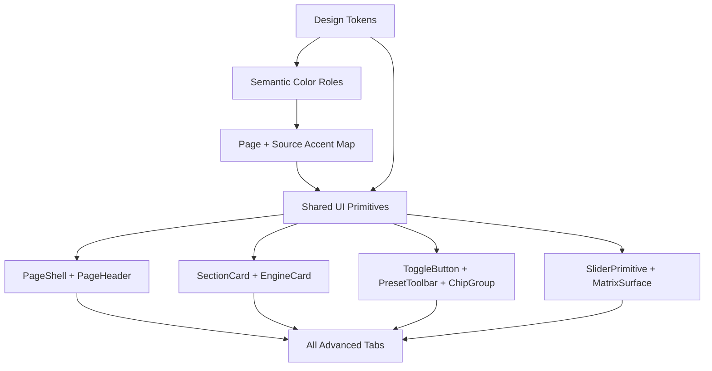

# UI Design System Audit

Date: 2026-05-03

Scope: Snowflake/simple mode plus the advanced tabs in `src/App.tsx`: Global, Synth, Drums, Earth, Granular, Delay, Reverb, Dynamics, and Routing.

Evidence captured from the running Vite app at `http://127.0.0.1:5175/`. Screenshots are stored in `docs/ui-audit/screenshots/`.

Reproduction recipe:

1. Run `npm run dev -- --host 127.0.0.1 --port 5175`.
2. Capture the listed screens from `http://127.0.0.1:5175/` at a desktop viewport near `1440x1100`.
3. Keep the screenshot names in the Evidence Snapshot table stable so `docs/ui-audit/index.html` continues to render the same artifact set.
4. Re-run `npm run type-check` after any implementation changes that follow from this audit.

## Executive Summary

The app already has a strong visual language: dark instrument panels, compact music-production controls, pale blue slider rails, restrained borders, and page-specific accents. The main issue is not lack of design direction. It is fragmentation: the same tokens, card types, preset controls, toggles, source bars, and helper copy are implemented repeatedly with small differences across pages.

The fastest path to unification is to make Reverb/Granular/Dynamics the canonical advanced-tab pattern, then migrate the older and special-purpose pages toward shared primitives:

- `PageShell`
- `PageHeader`
- `PresetToolbar`
- `SectionCard`
- `EngineCard`
- `ToggleButton`
- `ChipGroup`
- `MatrixSurface`
- `ControlHint`

## Evidence Snapshot

| Surface | Screenshot |
| --- | --- |
| Snowflake/simple |  |
| Global |  |
| Synth |  |
| Drums |  |
| Earth |  |
| Granular |  |
| Delay |  |
| Reverb |  |
| Dynamics |  |
| Routing |  |

## Current Design Inventory

### Core Tokens

The same token block is copied into most page CSS files:

- `--bg-base: #1a1a2e`
- `--bg-surface: rgba(15, 25, 40, 0.95)`
- `--bg-input: rgba(0, 0, 0, 0.3)`
- `--bg-control: rgba(255,255,255,0.08)`
- `--border-subtle: rgba(255,255,255,0.1)`
- `--text-primary: #e0e0e0`
- `--text-secondary: #9ca3af`
- `--accent-primary: #a5c4d4`
- `--radius-sm: 6px`
- `--radius-md: 8px`
- `--radius-lg: 12px`

Drift found:

- `global.css` uses a larger type scale for `--font-xs` and `--font-sm` than most pages.
- `dynamics.css` omits `--bg-elevated`, `--border-accent`, `--radius-lg`, and `--font-lg`.
- `routing.css` changes border opacity and muted text values.
- `App.tsx` and several page components still carry many inline colors and component styles.

### Measured Style Spread

| Metric | Current count | Audit read |
| --- | ---: | --- |
| Raw color expressions | 700 unique values | Too many one-off accents, opacity variants, and inline literals |
| Border radius values | 24 unique values | Mostly tokenized, but still scattered one-offs |
| Font-size values | 49 unique values | Small-control pages use many micro sizes below the token scale |
| Page CSS files | 12 | Page scoping is clear, but tokens are duplicated per page |

## Color Scheme Unification Map

The app should keep page-specific musical identity, but those colors need to come from a small semantic palette instead of raw literals scattered across page CSS and inline styles. The current problem is that the same intent is represented by different colors across pages: active navigation, page identity, enabled state, warnings, frozen state, source identity, and disabled state are all visually close but not systematically mapped.

The dashboard examples should show muted in-app usage, not bright palette gradients: dark card surfaces, subtle accent rails, low-alpha fills, compact chips, and slider tracks.

### Current Page Accents

| Surface | Muted example color | Proposed role | Target token |
| --- | --- | --- | --- |
| App navigation | Purple `#a855f7` used at low alpha fills | Active app navigation only | `--k-accent-nav` |
| Global | Pale blue `#a5c4d4` plus harmony indigo | Global/system control | `--k-page-global` |
| Synth | Pad editor blue `#4a9eff`, with the existing Pad visual trace palette | Sound-source family accents | `--k-page-synth` plus pad/lead/piano accents |
| Drums | Muted lavender `#a78bca`, with per-voice colors | Rhythm/source family accents | `--k-page-drums` plus voice accents |
| Earth | Muted water blue `#6f9fcf` plus source colors | Natural texture family accents | `--k-page-earth` plus source accents |
| Granular | Muted cyan `#5eb7c6` | Granular page identity | `--k-page-granular` |
| Delay | Soft blue `#aebce0` | Delay page identity and A/B lines | `--k-page-delay`, `--k-delay-a`, `--k-delay-b` |
| Reverb | Muted violet `#8b79c8` | Reverb page identity | `--k-page-reverb` |
| Dynamics | Muted amber `#c59a47` plus module accents | Dynamics page identity plus module states | `--k-page-dynamics` plus module accents |
| Routing | Pale blue `#a5c4d4` | Utility/matrix surface | `--k-page-routing` |
| Snowflake/simple | Muted cream `#cfc3ab` plus sage/slate variants | Immersive performance mode palette | `--k-snowflake-*` |

### Canonical Semantic Color Roles

| Role | Token | Color | Use |
| --- | --- | --- | --- |
| App active navigation | `--k-accent-nav` | `#a855f7` | Active tab, global app-mode affordances |
| Primary system accent | `--k-accent-primary` | `#a5c4d4` | Sliders, neutral active surfaces, routing utility chrome |
| Enabled/success | `--k-state-on` | `#10b981` | ON toggles, armed/available states |
| Disabled/off | `--k-state-off` | `#6f7888` | OFF toggles, unavailable controls, muted labels |
| Warning/attention | `--k-state-warn` | `#f59e0b` | Timer, cautionary settings, edit mode attention |
| Destructive/recording | `--k-state-danger` | `#ef4444` | Record, delete, destructive action |
| Frozen/held | `--k-state-freeze` | `#3b82f6` | Freeze/hold/spectral capture states |
| Page identity | `--k-page-*` | Page-specific | Page headers, section accents, local focus rings |
| Source identity | `--k-source-*` | Engine/source-specific | Voice rails, source dots, matrix row markers |

### Color Drift to Fix

- Purple currently means active navigation, Reverb, Dynamics degrade, evolve, and some drum states. Keep `--k-accent-nav` for app navigation, then move page/module purple to page-scoped tokens.
- Cyan currently means Granular, Dynamics, Delay, and general emphasis. Reserve `--k-accent-primary` for neutral controls; use `--k-page-granular`, `--k-page-dynamics`, and `--k-page-delay` for page identity.
- Green currently appears as enabled state and source identity. Use `--k-state-on` for ON toggles; use separate source tokens for insects, drums, or synth voices.
- Pale blue is used for sliders, utility accents, and page identity. Keep it as the neutral control accent and avoid using it as the unique identity for pages that already have stronger domain colors.
- Snowflake/simple mode has an intentional immersive palette, but its control chrome should still reference shared app tokens.
- Avoid full-saturation color blocks in documentation examples. Show accent color through rails, borders, chips, and low-alpha fills so the examples match the actual app.

### Color Migration Rules

1. Replace hard-coded literals with semantic tokens first: `--k-state-on`, `--k-state-off`, `--k-state-danger`, `--k-state-freeze`, `--k-accent-nav`, and `--k-accent-primary`.
2. Add page-level accent tokens second: `--k-page-global`, `--k-page-synth`, `--k-page-drums`, `--k-page-earth`, `--k-page-granular`, `--k-page-delay`, `--k-page-reverb`, `--k-page-dynamics`, and `--k-page-routing`.
3. Keep source/voice colors separate from state colors. A source rail can be green, but an ON toggle should always use `--k-state-on`.
4. Use opacity variants from tokenized RGB channels instead of writing new `rgba(...)` values for every border, fill, and hover state.
5. Let page accent color appear in the page header, section border highlights, focus rings, and selected local chips. Do not use it for every control on the page.

### Preset Color Hierarchy: L3 -> L2 -> L1

The app already stores presets as a hierarchy: L1 is the engine leaf, L2 is the kit/branch, and L3 is the source/page preset. The color system should follow that same structure, while the UI reads visually from the top down:

| Preset layer | Visual layer | Example scopes | Color rule |
| --- | --- | --- | --- |
| L3 source/page | Top-level source theme | `synth`, `drums`, `granular`, `delay`, `dynamics`, `reverb` | One muted page color for headers, selected source tabs, section focus, and source preset rows |
| L2 kit/branch | Engine family or kit | `drumKit`, `delayKit`, `earthKit`, `granularKit`, pad/lead kits | Related branch colors for kit cards, branch labels, and grouped preset rows |
| L1 engine leaf | Individual sound engine/module | `pad1`, `lead1`, `drumKick`, `echoLine`, `water`, `dynamicsDegrade` | Distinct but muted rail/chip/trace colors; do not recolor every control |
| Semantic state | Cross-cutting status | ON, OFF, record, warning, freeze, solo, mute | State tokens override source colors whenever the UI communicates status |

The Pad Synth visual already has a strong and likable color language: Pad 1 card/slot A blue `#4a9eff`, Pad 2 purple `#8b5cf6`, Filter A green `#10b981`, Filter B blue `#3b82f6`, and amp/mod envelope amber `#f59e0b`. Keep those as the canonical Synth visualization colors. Use them as thin traces, slot tags, rails, and low-alpha fills rather than large bright panels.

Recommended tree:

| L3 source theme | L2 branch | L1 engine leaves and colors |
| --- | --- | --- |
| Synth `#4a9eff` | Pad family `#4a9eff` | Pad 1 `#4a9eff`, Pad 2 `#8b5cf6`, Filter A `#10b981`, Filter B `#3b82f6`, Envelope `#f59e0b`, Pad 2 slot B `#ec4899` |
| Synth `#4a9eff` | Lead family `#f59e0b` | Lead 1 `#f59e0b`, Lead 2 `#06b6d4`, Lead 1 slot B `#8b5cf6`, Lead 2 slot D `#a78bfa` |
| Synth `#4a9eff` | Keys/piano `#e7c87f` | Piano/keys `#e7c87f`; keep it warm and harmonic rather than alert-like |
| Drums `#a78bca` | Drum kit `#a78bca` | Sub `#c05c5c`, Kick `#c47a4d`, Click `#c4a94b`, Metal `#6eaa7d`, Pluck `#5aa8b8`, Noise `#8b79c8`, Membrane `#b85a73` |
| Granular `#5eb7c6` | Granular kit `#5eb7c6` | Voice 1 `#5eb7c6`, Voice 2 `#6aa89a`, Voice 3 `#8b79c8`, Voice 4 `#c59a47`, Legacy `#6f7888` |
| Delay `#aebce0` | Delay kit `#aebce0` | Echo Line `#aebce0`, Clocked Space `#8b79c8`, Lead Delay `#c59a47`, Cross-feed `#6aa89a` |
| Reverb `#8b79c8` | Space character `#8b79c8` | Core `#8b79c8`, Spatial/IR `#6aa89a`, Modulation `#c59a47`, Tone `#aebce0`, Shimmer `#b66f9a`; Freeze uses `--k-state-freeze` |
| Dynamics `#c59a47` | Dynamics modules | Sidechain `#5eb7c6`, Character `#6eaa7d`, Degrade `#8b79c8`, Saturation `#c59a47`, End Chain `#b98a5a` |
| Earth `#6f9fcf` | Earth kit `#6f9fcf` | Water `#6f9fcf`, Insects 1 `#6eaa7d`, Insects 2 `#c59a47`, Weather/Nature `#aebce0` |
| Global/Routing `#a5c4d4` | Utility surfaces | Matrix rows, mixer buses, global clock, and route cells stay neutral unless they display a source assignment chip |

L3 colors should appear in page-level chrome. L2 colors should appear in kit/branch grouping. L1 colors should appear as small identity details: rails, source dots, compact chips, waveform traces, or selected-engine outlines. Parameter groups below L1 should use tonal variants of the L1 color at low alpha instead of adding another color level.

### Multi-Engine Color Strategy: Drums

Drums needs a layered color model because it has page chrome, seven voice engines, and four sequencer lanes. These should not all share the same meaning.

| Layer | What it colors | Token family | Rule |
| --- | --- | --- | --- |
| Page identity | Drums header, page-level bars, selected local tabs | `--k-page-drums` | One muted lavender/purple accent for the overall page |
| Voice identity | Voice card left rails, voice names, trigger flash, source chips | `--k-drum-*` | Stable per-voice colors; never used for ON/OFF state |
| Sequencer lane identity | Seq 1-4 lane tabs, lane headers, lane playhead details | `--k-seq-lane-*` | Separate from voice colors because a lane can target multiple voices |
| State | ON/OFF, mute, solo, record, frozen, warning | `--k-state-*` | Semantic colors always win over voice colors |

Proposed muted drum voice tokens:

| Voice | Current color | Muted target token | Use |
| --- | --- | --- | --- |
| Sub | `#ef4444` | `--k-drum-sub: #c05c5c` | Low-end voice rail and trigger flash |
| Kick | `#f97316` | `--k-drum-kick: #c47a4d` | Kick voice rail and source badge |
| Click | `#eab308` | `--k-drum-click: #c4a94b` | Click/transient voice rail |
| Metal | `#22c55e` | `--k-drum-metal: #6eaa7d` | High metallic/FM voice rail |
| Pluck | `#06b6d4` | `--k-drum-pluck: #5aa8b8` | Modal/pluck voice rail |
| Noise | `#8b5cf6` | `--k-drum-noise: #8b79c8` | Noise texture voice rail |
| Membrane | `#e11d48` | `--k-drum-membrane: #b85a73` | Physical/membrane voice rail |

Drum implementation rule: voice color should appear as a thin rail, small source dot/chip, selected voice outline, and trigger flash. Sliders and generic controls should remain neutral unless they are inside an active voice card, where the thumb/focus ring may borrow the voice accent at low alpha.

Sequencer implementation rule: keep `Seq 1-4` lane colors independent from drum voices. If a lane is assigned to a voice, show the voice as a chip inside the lane instead of repainting the whole lane. This keeps lane identity stable while still showing source assignment.

## Design System Visualization



## Consistency Heatmap

Scale: 1 = divergent, 5 = aligned.

| Page | Tokens | Layout | Cards | Controls | Helper Copy | Priority |
| --- | ---: | ---: | ---: | ---: | ---: | --- |
| Snowflake/simple | 1 | 2 | 1 | 2 | 3 | Medium |
| Global | 3 | 4 | 3 | 3 | 4 | High |
| Synth | 4 | 4 | 3 | 3 | 2 | High |
| Drums | 4 | 4 | 3 | 3 | 2 | High |
| Earth | 4 | 3 | 2 | 3 | 1 | High |
| Granular | 4 | 4 | 4 | 3 | 3 | Medium |
| Delay | 4 | 4 | 4 | 4 | 2 | Medium |
| Reverb | 4 | 4 | 5 | 4 | 3 | Low |
| Dynamics | 2 | 3 | 4 | 3 | 4 | Medium |
| Routing | 2 | 2 | 3 | 3 | 1 | High |

## Recommended Canonical Pattern

Use this hierarchy for every advanced tab:

1. App toolbar and tab bar from `App.tsx`.
2. `PageHeader`: title, page accent, engine enable/freezing/status actions.
3. Optional `PresetToolbar`: source or scene preset controls.
4. Main content: two-column or grid layout inside `PageShell`.
5. `SectionCard`: ordinary parameter sections.
6. `EngineCard`: source/voice cards that need a left accent rail.
7. `MatrixSurface`: dense routing or sequencer matrix controls.

Canonical visual rules:

- Backgrounds: app background only at shell; cards use `--surface-1`; nested controls use `--surface-2`.
- Radii: 6px controls, 8px cards, 12px page-level bars only.
- Type: keep page/body controls on a small but explicit scale instead of one-off micro values.
- Accent: selected navigation stays one global accent; page accent is used inside the active page.
- Copy: persistent instructions move into help overlays or compact hint rows.

## Per-Page Change Plan

### Snowflake/simple

Current: immersive standalone canvas with inline styling and separate control grammar.

Change:

- Move colors, button dimensions, shadows, and splash styles into shared tokens.
- Replace text-symbol buttons with the same icon-button primitive used by advanced mode.
- Keep the immersive Snowflake layout, but align play, preset, journey, and advanced actions to the global icon language.
- Make `Show Help` use the same button size, radius, and focus state as advanced toolbar controls.

### Global

Current: strong content structure, but uses unique card names (`mixer-card`, `presets-card`, `harmony-card`, `utility-card`) and a larger local type scale.

Change:

- Add a `PageHeader` so Global has the same top rhythm as Reverb, Granular, and Dynamics.
- Convert `mixer-card`, `presets-card`, `harmony-card`, and `utility-card` to `SectionCard`.
- Normalize `--font-xs` and `--font-sm` to the shared page scale.
- Keep the collapsible Harmony sections, but use a shared `SectionHeader` with the same chevron, padding, and hover state as Delay cards.

### Synth

Current: rich and feature-complete, but visually dense. It uses its own source preset bar, multiple synth card header styles, inline styles, and many micro font sizes.

Change:

- Replace `synth-source-preset-bar` with shared `PresetToolbar`.
- Convert Pad, Pad 2, Lead 1, Lead 2, Piano, and Keyboard sections to `EngineCard`.
- Convert advanced subareas (`Filter`, `Envelope`, `Space`, `LFO`, `Oscillators`) to nested `SectionCard` variants or a shared `SubsectionLabel`.
- Standardize the `Edit preset`, A/B, save, random, and walk controls through shared buttons/chips.
- Reduce one-off font sizes below `--font-xs`; dense controls can use a `compact` prop rather than raw values.

### Drums

Current: closely related to Synth and already has a useful source/pattern flow, but voice cards and sequencer controls use many specialized classes.

Change:

- Replace `drums-source-preset-bar`, `drums-pattern-preset-bar`, and `master-strip` with shared toolbar primitives.
- Use the same `EngineCard` header/body contract as Synth voice/source cards.
- Normalize trigger/edit buttons to shared icon buttons with a compact size.
- Keep the drum-specific left color rail, but make it an `EngineCard` option rather than a unique card implementation.
- Align sequencer tabs with the Synth sequencer tab primitive.

### Earth

Current: the Active Earth Matrix is useful but feels like a separate product surface. It includes persistent instructions and chip/matrix styles that differ from Routing.

Change:

- Add `PageHeader` plus a single Earth preset toolbar.
- Move long how-to copy into the help overlay and keep only a short context hint if needed.
- Reuse `MatrixSurface` with Routing so source chips, active rows, sliders, and column tabs share one dense-control language.
- Normalize source chips (`Water`, `Hard Drops`, `Turbulence`) to `ChipGroup`.
- Make the shared routing tabs (`Level`, `Space`, `Delay A`, etc.) visually match Routing matrix column buttons.

### Granular

Current: one of the strongest pages. It already uses the section-card pattern and a clear page header.

Change:

- Use shared `PageHeader` for the title, enable toggle, and Freeze action.
- Replace `granular-chip-group` and `granular-chip-btn` with shared `ChipGroup`.
- Move inline section styles into CSS tokens.
- Keep buffer/voice-specific visualization styles, but make their surrounding chrome `SectionCard`.
- Align enable and freeze button states with Reverb and Dynamics.

### Delay

Current: coherent and practical, with strong grouped cards and clear state. It differs from Reverb/Granular by relying more on left-accent collapsible cards.

Change:

- Promote `delay-source-preset-bar` into shared `PresetToolbar`.
- Use `SectionCard` for `Cross-Feeds`, `Preset Linkage`, and `Master Saturation`.
- Reserve left-accent `EngineCard` for `Echo Line` and `Clocked Space`.
- Align mode/toggle buttons with the shared `ToggleButton`.
- Reuse the same visualization tab control as Reverb visualizer cards.

### Reverb

Current: best candidate for the canonical advanced-page pattern.

Change:

- Extract its `reverb-global-bar`, `reverb-section-card`, `reverb-section-head`, `reverb-section-body`, and `reverb-preset-body` into shared primitives.
- Keep page-specific accent tokens, but source common values from a global token file.
- Align Freeze button state naming with Granular.
- Make section notes use a consistent optional placement and max width.

### Dynamics

Current: structurally close to Reverb/Granular but missing several shared tokens and has multiple OFF labels.

Change:

- Add missing shared tokens: `--bg-elevated`, `--border-accent`, `--radius-lg`, `--font-lg`.
- Use `PageHeader` and shared `PresetToolbar`.
- Normalize `FX Off`, `OFF`, and per-section toggle labels through one `ToggleButton` state.
- Keep Character, Degrade, Saturation, End Chain Compression, and Sidechain as `SectionCard` variants.
- Collapse or move the visible Debug Info panel behind a development toggle so it does not interrupt the page rhythm.

### Routing

Current: matrix content is valuable but visually sits outside the Reverb/Granular/Dynamics grammar. It also has the most instructional copy on the page.

Change:

- Add `PageHeader` with title and optional compact page note.
- Convert `routing-card` to `SectionCard`.
- Move detailed instructions into `SliderHelpOverlay`.
- Make matrix column buttons, row labels, and cells a shared `MatrixSurface` primitive reused by Earth.
- Use the same slider sizing and value typography as dense sequencer/matrix controls.

## Implementation Sequence

1. Create `src/ui/designSystem.css` for global tokens and import it from `src/main.tsx`.
2. Add shared primitives under `src/ui/primitives/`.
3. Migrate Reverb first because it is already closest to the target.
4. Migrate Granular and Dynamics next by replacing local class groups with shared primitives.
5. Migrate Delay, preserving its engine-card left rail only where it communicates signal flow.
6. Migrate Synth and Drums together because they share sequencer and voice-card patterns.
7. Migrate Earth and Routing together around a shared `MatrixSurface`.
8. Finish with Global and Snowflake/simple to align shell-level controls and typography.

## Proposed Token File

```css
:root {
  --k-bg-app: #1a1a2e;
  --k-bg-surface: rgba(15, 25, 40, 0.95);
  --k-bg-surface-soft: rgba(255, 255, 255, 0.05);
  --k-bg-control: rgba(255, 255, 255, 0.08);
  --k-bg-control-hover: rgba(255, 255, 255, 0.15);

  --k-border-subtle: rgba(255, 255, 255, 0.1);
  --k-border-medium: rgba(255, 255, 255, 0.2);
  --k-border-accent: rgba(100, 150, 200, 0.3);

  --k-text-primary: #e0e0e0;
  --k-text-secondary: #9ca3af;
  --k-text-muted: #666;
  --k-text-dim: #555;

  --k-accent-nav: #a855f7;
  --k-accent-primary: #a5c4d4;
  --k-accent-cyan: #06b6d4;
  --k-accent-green: #10b981;
  --k-accent-amber: #f59e0b;
  --k-accent-red: #e74c3c;

  --k-state-on: #10b981;
  --k-state-off: #6f7888;
  --k-state-warn: #f59e0b;
  --k-state-danger: #ef4444;
  --k-state-freeze: #3b82f6;

  --k-page-global: #a5c4d4;
  --k-page-synth: #4a9eff;
  --k-page-drums: #a78bca;
  --k-page-earth: #6f9fcf;
  --k-page-granular: #5eb7c6;
  --k-page-delay: #aebce0;
  --k-page-reverb: #8b79c8;
  --k-page-dynamics: #c59a47;
  --k-page-routing: #a5c4d4;

  --k-synth-pad-1: #4a9eff;
  --k-synth-pad-2: #8b5cf6;
  --k-synth-pad-filter-a: #10b981;
  --k-synth-pad-filter-b: #3b82f6;
  --k-synth-pad-env: #f59e0b;
  --k-synth-pad-slot-b: #ec4899;
  --k-synth-lead-1: #f59e0b;
  --k-synth-lead-2: #06b6d4;
  --k-synth-piano: #e7c87f;
  --k-synth-seq-lane-1: #f59e0b;
  --k-synth-seq-lane-2: #10b981;
  --k-synth-seq-lane-3: #3b82f6;
  --k-synth-seq-lane-4: #ec4899;

  --k-drum-sub: #c05c5c;
  --k-drum-kick: #c47a4d;
  --k-drum-click: #c4a94b;
  --k-drum-metal: #6eaa7d;
  --k-drum-pluck: #5aa8b8;
  --k-drum-noise: #8b79c8;
  --k-drum-membrane: #b85a73;

  --k-granular-voice-1: #5eb7c6;
  --k-granular-voice-2: #6aa89a;
  --k-granular-voice-3: #8b79c8;
  --k-granular-voice-4: #c59a47;
  --k-granular-legacy: #6f7888;

  --k-delay-echo-line: #aebce0;
  --k-delay-clocked-space: #8b79c8;
  --k-delay-lead: #c59a47;
  --k-delay-crossfeed: #6aa89a;

  --k-reverb-core: #8b79c8;
  --k-reverb-spatial: #6aa89a;
  --k-reverb-modulation: #c59a47;
  --k-reverb-tone: #aebce0;
  --k-reverb-shimmer: #b66f9a;

  --k-dynamics-sidechain: #5eb7c6;
  --k-dynamics-character: #6eaa7d;
  --k-dynamics-degrade: #8b79c8;
  --k-dynamics-saturation: #c59a47;
  --k-dynamics-end-chain: #b98a5a;

  --k-earth-water: #6f9fcf;
  --k-earth-insects-1: #6eaa7d;
  --k-earth-insects-2: #c59a47;
  --k-earth-nature: #aebce0;

  --k-seq-lane-1: #5eb7c6;
  --k-seq-lane-2: #b66f85;
  --k-seq-lane-3: #6eaa7d;
  --k-seq-lane-4: #c59a47;

  --k-radius-control: 6px;
  --k-radius-card: 8px;
  --k-radius-bar: 12px;

  --k-font-2xs: 0.55rem;
  --k-font-xs: 0.65rem;
  --k-font-sm: 0.75rem;
  --k-font-md: 0.85rem;
  --k-font-lg: 1rem;

  --k-space-1: 4px;
  --k-space-2: 6px;
  --k-space-3: 8px;
  --k-space-4: 10px;
  --k-space-5: 12px;
  --k-space-6: 16px;
}
```

## Success Criteria

- Each page imports shared tokens instead of redefining the base token block.
- All advanced pages have a `PageHeader`.
- Source and scene preset controls use one `PresetToolbar`.
- Section cards use one header/body/padding system.
- Voice/source cards use one left-accent `EngineCard`.
- Earth and Routing share one matrix surface.
- Persistent instructional copy is moved to help overlays or compact contextual hints.
- Color uses the L3 source -> L2 kit/branch -> L1 engine tree, with semantic state colors kept separate from source identity.
- New pages can be built from the primitive set without adding a new page-specific card grammar.
